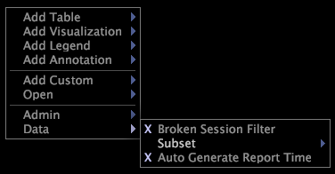

# Creación de subconjuntos{#create-subsets}

Pasos para crear un subconjunto.

>[!NOTE]
>
>Para crear o cambiar un subconjunto, debe estar trabajando en línea.

1. Mientras trabaja en línea, realice las selecciones deseadas dentro de una o varias visualizaciones de su espacio de trabajo.

   Para obtener más información sobre la interpretación de selecciones, consulte [Realización de selecciones en visualizaciones](../../../../home/c-get-started/c-vis/c-sel-vis/c-sel-vis.md#concept-012870ec22c7476e9afbf3b8b2515746).

1. Haga clic con el botón derecho en el espacio de trabajo y haga clic en **[!UICONTROL Data]** > **[!UICONTROL Subset]** > *&lt;**[!UICONTROL level name]**>*
.

   

Aparece una X a la izquierda de la opción [!DNL Subset menu] y a la izquierda del nivel del subconjunto.
