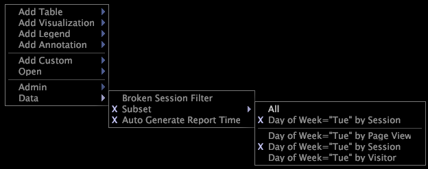

# Eliminar un subconjunto{#remove-a-subset}

Pasos para eliminar un subconjunto de datos.

* Mientras trabaja en línea, haga clic con el botón derecho en el espacio de trabajo y haga clic en **[!UICONTROL Data]** > **[!UICONTROL Subset]** > **[!UICONTROL All]**.

   

