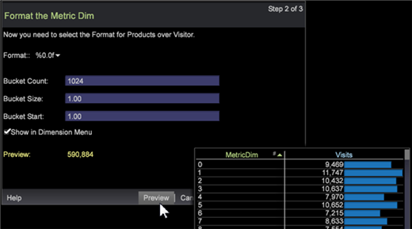

# Asistente para atenuación de métricas{#metric-dim-wizard}

Utilice el asistente de atenuación de métricas para crear un nuevo Dimension de métricas.

Una atenuación de métricas convierte una métrica en una nueva dimensión. Por ejemplo, una atenuación de métrica basada en una métrica de vistas de página y el nivel de visitante mostrará elementos de dimensión según el total de vistas de página de cada visitante. Permite ampliar una métrica definida actualmente basada en elementos de dimensión para crear y guardar como una nueva dimensión.

## Paso 1: seleccionar dimensión y métrica {#section-58b6ea7bbba5487ba1a3c264aa3dcb95}

1. **Abra el Asistente para atenuación de métricas**.

   En un espacio de trabajo, haga clic con el botón derecho y seleccione **Tools** > **Create Metric Dim**.

1. **Asigne un nombre a la atenuación de métricas**.

   De forma predeterminada, el campo Nombre se rellenará automáticamente en función de las selecciones Nivel y Métrica .

1. **Seleccione un nivel de Dimension.** El nivel de dimensión es la dimensión principal que contiene todos los valores de elemento constituyente para filtrar la entrada y definir un tipo de dimensión.

   Los niveles de Dimension incluyen:

   * Pulsación
   * Visita individual
   * Producto
   * Visita
   * Visitante.

1. **Seleccionar una métrica**.

   Seleccione una métrica prediseñada para ampliarla y guardarla como métrica atenuada.

   

1. (opcional) **Crear una fórmula de métrica**.

   Haga clic en el cuadro para introducir una fórmula de métrica personalizada. El valor Vista previa calculado aparecerá validando la expresión.

   

   Puede agregar su propia [expresión de métrica](https://experienceleague.adobe.com/docs/data-workbench/using/client/qry-lang-syntx/c-syntx-mtrc-exp.html) o cortar y pegar desde otro editor o visualización de métricas. Los errores de sintaxis, los errores de fórmula, los filtros no definidos y otros errores se informan en el asistente.

1. Haga clic en **Siguiente**.

## Paso 2: formatear y definir contenedores {#section-5bddf3cd306545d7806a501637f80f77}

Puede seleccionar el formato de métrica y establecer los valores de bloque para una expresión de dimensión.

1. Seleccione un **Formato** para la nueva métrica atenuada.

   

   El formato define cómo se presentará la métrica cuando se abra en una visualización. Estos formatos están seleccionados [printf standard](http://www.cplusplus.com/reference/cstdio/printf/), definidos a continuación:

   ```
   %[flags][width][.precision][length][specifier]
   %
   0.2lf = % _ [flags] 0 [width] .2 [.precision] l [length] f[ specifier]
   ```

   En el campo **Preview** aparece un valor basado en la métrica y el formato seleccionados.

1. Agregue la expresión **Recuento de bloques**.

   Puede definir una atenuación de métrica con varios intervalos o bloques. Esto devuelve subconjuntos de elementos basados en el tamaño, como [0-4], [5-10],...). Los elementos del nivel de Dimension están relacionados con los elementos cuyo intervalo contiene el valor de la métrica. Consulte la descripción de la expresión del bloque en [Sintaxis para expresiones de Dimension](https://experienceleague.adobe.com/docs/data-workbench/using/client/qry-lang-syntx/c-syntx-dim-exp.html).

1. Haga clic en **Vista previa** para abrir la tabla de valores de atenuación de métricas antes de guardar.

   

   La tabla detalla los valores de las métricas por cada métrica atenuada.

1. Haga clic en **Mostrar en el menú del Dimension** para añadir la dimensión recién creada a la pestaña **Dimension** en el **Buscador**.
1. Haga clic en **Siguiente**.

## Paso 3: finalizar y guardar {#section-d9043235b18a425f9de0db668d4b1683}

1. Seleccione para iniciar el Editor de atenuación de métricas, la visualización de gráficos o la tabla después de guardar.

   | Campo | Descripción |
   |---|---|
   | Iniciar Editor de atenuación de métricas | Abra el Editor de atenuación de métricas. |
   | Gráfico de Launch | Inicie un gráfico PNG de la tabla. |
   | Tabla de lanzamiento | Inicie una tabla en el espacio de trabajo con valores en columnas que enumeran los valores de la nueva métrica atenuados en comparación con los valores de la métrica seleccionada. |

1. Haga clic en **Finish** y guarde.

   Se abrirá un cuadro de diálogo que le permitirá guardar el archivo. Las opciones seleccionadas para ver los valores se abrirán en el espacio de trabajo.
