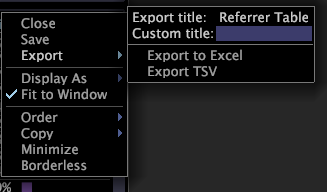

# Exportación de datos de ventana{#export-window-data}

{{eol}}

Puede exportar los datos de ciertas ventanas a un archivo de Excel (.xls o .xlsx) o a un archivo de valores separados por tabuladores (.tsv).

Los datos no se exportan desde gráficos, navegadores de rutas, mapas de procesos, gráficos de puntos y globos.

## Exportar datos de ventana a Microsoft Excel {#section-b660adf7f4f64a2b9be7287c591b67b0}

Para exportar datos de ventanas individuales a Microsoft Excel, se deben cumplir los siguientes requisitos:

* Microsoft Excel debe estar instalado en el mismo equipo que la Data Workbench.
* La cuenta de usuario en la que se está ejecutando el proceso de Data Workbench debe tener permiso para acceder a Microsoft Excel.
* Al exportar datos como archivos de Excel, se abre una nueva instancia de Excel.
* Aunque la Data Workbench admite más de 256 columnas y 65.536 filas de datos, las versiones de Microsoft Excel anteriores a la versión 8.0 no lo hacen.

Si se cumplen estos requisitos, la Data Workbench inicia automáticamente Microsoft Excel y exporta los datos a un nuevo libro de Excel al seleccionar la variable **[!UICONTROL Export To Excel]** para abrir el Navegador.

**Para exportar datos de ventana a un archivo .xls o .xlsx**

Haga clic con el botón derecho en el borde superior de la ventana y haga clic en **[!UICONTROL Export]** > **[!UICONTROL Export to Excel]**.

Excel abre un nuevo libro que contiene los datos exportados. A menos que haya proporcionado un título personalizado (como se describe en la sección siguiente), este libro se nombra con la variable [!DNL Export title] (Tabla de día en el ejemplo anterior).

## Aplicar títulos personalizados {#section-2a6559df812a470685e43923b7b9024e}

Si proporciona un título personalizado para una ventana (mediante la variable [!DNL Custom title] en el campo [!DNL Export] ) la hoja de cálculo a la que la Data Workbench exporta los datos tiene el nombre utilizando este título personalizado en lugar del título en la [!DNL Export title] (Tabla de día en el ejemplo anterior).

**Aplicación de un título personalizado a una visualización**

1. Haga clic con el botón derecho en el borde superior de la ventana y, a continuación, haga clic en **[!UICONTROL Custom title]** campo .
1. you

Cuando exporta la visualización a Excel, la hoja de cálculo que contiene los datos de esta ventana recibe un nombre usando el título especificado en lugar del título en la variable [!DNL Export title] campo .

## Exportar datos de ventana a un archivo TSV {#section-93c6b24f7338430aaf5a63b99b9489e8}

**Para exportar una ventana a un archivo .tsv**

Haga clic con el botón derecho en el borde superior de la ventana y haga clic en **[!UICONTROL Export]** > **[!UICONTROL Export TSV]**.

1. Aparece el cuadro de diálogo [!DNL Save Window].
1. Vaya al directorio en el que desea guardar el archivo. Cambie el nombre del archivo si es necesario y haga clic en **[!UICONTROL Save]**.
