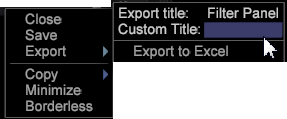

# Menú Controles de ventana{#window-controls-menu}

{{eol}}

El menú Controles de ventana permite controlar una ventana individual.

Haga clic con el botón derecho en el borde superior de la ventana.

Estas opciones del menú varían según el tipo de ventana. La tabla del siguiente procedimiento contiene descripciones de los elementos de menú básicos disponibles para la mayoría de tipos de ventanas. En las secciones correspondientes de esta guía se tratan las opciones adicionales disponibles para determinados tipos de ventanas.

<table id="table_13ADF7B7E50E44D890768A5F9BAC8D06"> 
 <thead> 
  <tr> 
   <th colname="col1" class="entry"> Opción del menú </th> 
   <th colname="col2" class="entry"> Descripción </th> 
  </tr> 
 </thead>
 <tbody> 
  <tr> 
   <td colname="col1"> Cierre </td> 
   <td colname="col2"> Cierra la ventana actual. </td> 
  </tr> 
  <tr> 
   <td colname="col1"> Guardar </td> 
   <td colname="col2">Guarda la visualización (como un  .vw ) en su estado actual. El cuadro de diálogo que aparece le permite guardar la visualización con un nombre diferente o en una ubicación diferente. La ubicación predeterminada es Usuario\<i>nombre de perfil</i>\carpeta de trabajo dentro del directorio de instalación de la Data Workbench. </td> 
  </tr> 
  <tr> 
   <td colname="col1"> Mostrar como </td> 
   <td colname="col2">(Disponible solo para tablas). Muestra los datos de una tabla como números, barras o ambas al mismo tiempo. Consulte <a href="../../../home/c-get-started/c-analysis-vis/c-tables/c-chg-tbl-disp.md#concept-c515caeefce9495f88873a10dc112770"> Cambio de la visualización de la tabla</a>. </td> 
  </tr> 
  <tr> 
   <td colname="col1"> Mostrar </td> 
   <td colname="col2">(Disponible solo para gráficos). Muestra los datos en un gráfico como líneas o barras. Consulte <a href="../../../home/c-get-started/c-analysis-vis/c-graphs/c-chg-graph-disp.md#concept-eaba669d90f64cfa872f1397205fe2f7"> Cambio de la visualización del gráfico</a>. </td> 
  </tr> 
  <tr> 
   <td colname="col1"> Ajustar a ventana </td> 
   <td colname="col2">Permite que el contenido de la ventana se amplíe o reduzca automáticamente para ajustarse a la ventana cada vez que se cambia su tamaño. Consulte <a href="../../../home/c-get-started/c-analysis-vis/c-annots/c-image-annots.md#concept-02081ed7d91c4fdcb8fc863f2a51c962"> Uso de anotaciones de imagen</a> y <a href="../../../home/c-get-started/c-analysis-vis/c-tables/c-fit-data-win.md#concept-b812b1171fc240d9a4cf6d6d57f621a6"> Ajuste de datos a la ventana</a>. </td> 
  </tr> 
  <tr> 
   <td colname="col1"> Pedido </td> 
   <td colname="col2"> 
Organiza las capas de ventanas en el espacio de trabajo. Los comandos de pedido incluyen lo siguiente: 
     <ul id="ul_90391B26719040AE8E0F80FE33B106FD"> 
      <li id="li_D1B38998C8CC452D8B642132B94F92F7">Parte frontal: Lleva la ventana al frente de la pantalla. </li> 
      <li id="li_71EEC709AA734924AE8740313031DF6E">Normal: Deja la ventana en la posición en la que se abrió. </li> 
      <li id="li_B6489677FF5540E4BD854EE1CE504CCA">Atrás: Coloca la ventana detrás de cualquier otra ventana abierta en la pantalla actual. </li> 
     </ul> 
 
Aparece una X a la izquierda de la opción activa. 
 </td> 
  </tr> 
  <tr> 
   <td colname="col1"> Copiar </td> 
   <td colname="col2">Copia ventanas individuales en el portapapeles para usarlas en aplicaciones de terceros. Después de copiar una ventana al portapapeles, puede pegarla en aplicaciones de oficina comunes, como Microsoft Word, Microsoft PowerPoint o un mensaje de correo electrónico de Microsoft Outlook. Para copiar una ventana, haga clic con el botón derecho en su borde superior y haga clic en  Copiary haga clic en la opción correspondiente: 
    <ul id="ul_ECCD6A70729E40998C64714E01504995"> 
     <li id="li_21D375DAE7BC4F449C8A3225296A6D26">El fondo negro copia el espacio de trabajo como se muestra. </li> 
     <li id="li_1B08C688678F42948E0952EEE0BF2B30">El fondo blanco copia los elementos del espacio de trabajo en color y los muestra en un fondo blanco. </li> 
     <li id="li_86F497A2275C43B5835DEDD0A4BF76E8">El fondo blanco (B&amp;W) copia los elementos del espacio de trabajo en escala de grises y los muestra en un fondo blanco. </li> 
    </ul> </td> 
  </tr> 
  <tr> 
   <td colname="col1"> Minimizar </td> 
   <td colname="col2"> Reduce el tamaño total de la ventana, mientras que todo el contenido de la ventana permanece visible pero no se actualiza. Haga clic con el botón derecho en la ventana minimizada para restaurarla a su tamaño original. </td> 
  </tr> 
  <tr> 
   <td colname="col1"> Sin borde </td> 
   <td colname="col2"> Quita los bordes alrededor de la ventana seleccionada. Este comando es muy útil al crear informes. </td> 
  </tr> 
 </tbody> 
</table>
