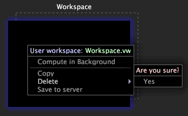

# Eliminación de un espacio de trabajo{#deleting-a-workspaces}

Información sobre la eliminación de espacios de trabajo de la superficie de trabajo.

Un espacio de trabajo local es una versión local de un espacio de trabajo que existe en el servidor. Un espacio de trabajo de usuario solo existe en el equipo local.

**Para eliminar espacios de trabajo locales de[!DNL Worktop]**

Haga clic con el botón derecho en el espacio de trabajo que desee eliminar y haga clic en **[!UICONTROL Revert to server version]** > **[!UICONTROL Yes]**. Se elimina la versión local, pero la versión del servidor permanece.

>[!NOTE]
>
>Cuando tiene una versión local de un espacio de trabajo del servidor, debe perder los cambios revertiendo a la versión del servidor antes de poder descargar una versión actualizada del espacio de trabajo del servidor.

**Para eliminar espacios de trabajo de usuario de[!DNL Worktop]**

Haga clic con el botón derecho en el espacio de trabajo que desee eliminar y haga clic en **[!UICONTROL Delete]**.

