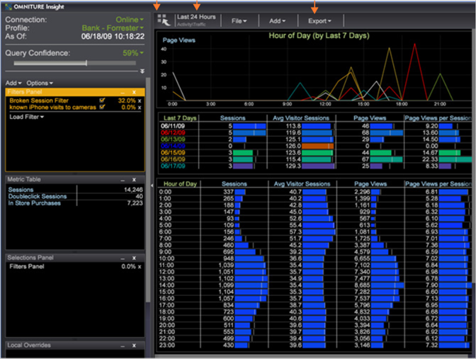

# Mostrar un espacio de trabajo{#display-a-workspace}

Después de trabajar en la Data Workbench, puede mostrar uno de los muchos espacios de trabajo preconfigurados con Data Workbench.

La barra lateral es una función persistente del espacio de trabajo, a menos que la oculte. Consulte [Configuración de la barra lateral](../../../home/c-get-started/c-config-sidebar.md#concept-41db771b302e43018e5a9daa40b397e6).

**Visualización de un espacio de trabajo existente**

En la ficha [!DNL Worktop] que desee, haga clic en la miniatura del espacio de trabajo que desee mostrar.

>[!NOTE]
>
>Después de abrir un nuevo espacio de trabajo, es posible que tenga que hacer clic en **[!UICONTROL Add]** > **[!UICONTROL Temporarily Unlock]**.

A continuación se muestra un ejemplo de espacio de trabajo abierto.

**Desplazamiento dentro de un espacio de trabajo**

Con el cursor fuera del espacio de trabajo, utilice la rueda de desplazamiento del ratón para desplazarse por el espacio de trabajo.
