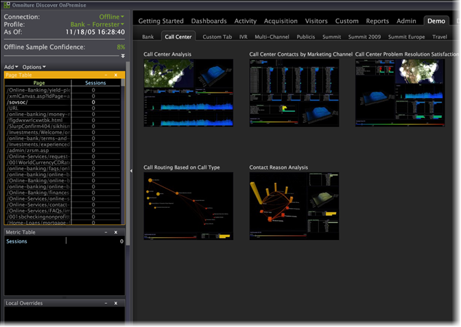

# Inicio de Data Workbench{#opening-data-workbench}

Una vez que la Data Workbench se haya instalado y esté conectada al servidor, puede utilizarla para analizar los datos procesados.

1. Vaya al directorio de instalación de la Data Workbench.
1. Haga doble clic en [!DNL insight.exe] para iniciar la aplicación.
1. Haga clic en **[!UICONTROL Login]**.

   

1. Introduzca sus credenciales.

   

   La primera vez que se inicia, el sistema muestra la página [!DNL Start] y comienza a descargar datos de perfil y la caché de datos.

1. Una vez que la caché de datos comience a rellenarse, haga clic en **[!UICONTROL Start]**.

   El sistema muestra [!DNL Worktop].

   

   La próxima vez que inicie la Data Workbench, el sistema omitirá la página [!DNL Start] y mostrará el [!DNL Worktop], a menos que se haya agregado un nuevo perfil al servidor.

   Las actualizaciones del perfil y sus datos se descargan únicamente si está trabajando en línea y tiene una conexión de red con el servidor de Data Workbench. Para obtener más información sobre cómo trabajar en línea, consulte [Trabajar sin conexión y en línea](../../home/c-get-started/c-off-on.md#concept-cef8758ede044b18b3558376c5eb9f54).

   >[!NOTE]
   >
   >No se recomienda que varios usuarios compartan un solo equipo para utilizar la estación de trabajo.
