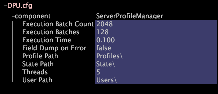

# Configuración de DPU.cfg{#configuring-dpu-cfg}

El archivo de configuración de DPU, DPU.cfg, especifica varios parámetros de rendimiento para Insight Server.

La forma de configurar estos parámetros depende del tamaño del conjunto de datos y de muchos otros factores. Póngase en contacto con los servicios de consultoría de Adobe para obtener ayuda con el ajuste del rendimiento.

**Frecuencia recomendada:** solo cuando sea necesario

**Para cambiar la configuración de rendimiento de  [!DNL Insight Server] DPU**

1. En [!DNL Insight], en la pestaña [!DNL Admin] > [!DNL Dataset and Profile], haga clic en la miniatura **[!UICONTROL Servers Manager]** para abrir el espacio de trabajo del Administrador de servidores.
1. Haga clic con el botón derecho en el icono del [!DNL Insight Server] que desee configurar y haga clic en **[!UICONTROL Server Files]**.
1. En [!DNL Server Files Manager], haga clic en **[!UICONTROL Components]** para ver su contenido. El archivo [!DNL DPU.cfg] se encuentra dentro de este directorio.
1. Haga clic con el botón derecho en la marca de verificación de la columna *server name* para [!DNL DPU.cfg] y haga clic en **[!UICONTROL Make Local]**. Aparece una marca de verificación en la columna [!DNL Temp] de [!DNL DPU.cfg].
1. Haga clic con el botón derecho en la marca de verificación recién creada en la columna [!DNL Temp] y haga clic en **[!UICONTROL Open]** > **[!UICONTROL in Insight]**.
1. En la ventana [!DNL DPU.cfg] , haga clic en el componente para ver su contenido.
1. Cambie el rendimiento y la configuración de la ruta, según sea necesario. Para obtener una lista de los parámetros disponibles en este archivo, consulte [Configuración de rendimiento de DPU](../../../home/c-inst-svr/c-cfg-stgs-ref/c-dpu-perf-stgs.md#concept-477c4c526de44bda84176e62266c3df1).

   >[!NOTE]
   >
   >Póngase en contacto con Adobe antes de cambiar cualquiera de los parámetros de este archivo.

   

1. Guarde los cambios en el servidor haciendo lo siguiente:

   1. Haga clic con el botón derecho **[!UICONTROL (modified)]** en la parte superior de la ventana y haga clic en **[!UICONTROL Save]**.

   1. En [!DNL Server Files Manager], haga clic con el botón derecho en la marca de verificación del archivo en la columna [!DNL Temp] y seleccione **[!UICONTROL Save to]** > *&lt;**[!UICONTROL server name]**>*.
