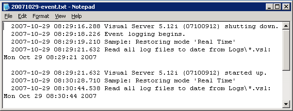

# Monitoreo de eventos administrativos{#monitoring-administrative-events}

Debe supervisar regularmente los archivos de registro de eventos para rastrear los mensajes de eventos del sistema de Insight Server, que se registran en los `<YYYYMMDD>-event.txt` archivos ubicados de forma predeterminada en la carpeta Events dentro del directorio de instalación de Insight Server.

**Frecuencia recomendada:** Cada 5-10 minutos

Puede supervisar estos eventos mediante la [!DNL Server Files Manager] función [!DNL Insight], la herramienta de administración automatizada, los [!DNL *-event.txt] archivos o el visor de eventos de Windows.

>[!NOTE]
>
>Los registros de eventos administrativos están completamente separados del registro de eventos de Windows, pero contienen algunos de los mismos eventos. Los registros de eventos administrativos contienen información solamente sobre [!DNL Insight Server] eventos.

**Para ver los archivos events.txt mediante la variable[!DNL Server Files Manager]**

1. En [!DNL Insight], en la ficha [!DNL Admin] > [!DNL Dataset and Profile] , haga clic en la **[!UICONTROL Servers Manager]** miniatura para abrir el espacio de trabajo del Administrador de servidores.
1. Haga clic con el botón derecho en el icono de un elemento activo [!DNL Insight Server] y haga clic en **[!UICONTROL Server Files]**.
1. En el [!DNL Server Files Manager], haga clic **[!UICONTROL Events]** para ver su contenido.
1. Haga clic con el botón secundario en la marca de verificación de la columna del nombre *del* servidor junto al archivo deseado y haga clic en **[!UICONTROL Make Local]**. Aparece una marca de verificación junto al nombre del archivo en la [!DNL Temp] columna.
1. Haga clic con el botón secundario en la marca de verificación de la [!DNL Temp] columna y haga clic en **[!UICONTROL Open]** > **[!UICONTROL in Notepad]**. El archivo de evento aparece en una nueva ventana del Bloc de notas de Microsoft Windows.

   

   El [!DNL Server.log] archivo de la [!DNL Trace] carpeta del directorio de [!DNL Insight Server] instalación contiene información de registro más detallada.

**Para ver eventos a través del visor de eventos de Windows**

* Haga clic **[!UICONTROL Start]** > **[!UICONTROL Control Panel]** > **[!UICONTROL Administrative Tools]** > **[!UICONTROL Event Viewer]**.

**Para cambiar el directorio Registro de eventos administrativos**

El archivo de configuración Registros de eventos administrativos [!DNL Administrative Events Log.cfg]especifica el directorio al que se genera el registro de eventos.

1. En [!DNL Insight], en la ficha [!DNL Admin] > [!DNL Dataset and Profile] , haga clic en la **[!UICONTROL Servers Manager]** miniatura para abrir el espacio de trabajo del Administrador de servidores.

1. Haga clic con el botón secundario en el icono del [!DNL Insight Server] que desee configurar y haga clic en **[!UICONTROL Server Files]**.

1. En el [!DNL Server Files Manager], haga clic **[!UICONTROL Components]** para ver su contenido. El [!DNL Administrative Event Logs.cfg] archivo se encuentra dentro de este directorio.

1. Haga clic con el botón secundario en la marca de verificación de la columna del nombre *del* servidor [!DNL Administrative Event Logs.cfg] y haga clic en **[!UICONTROL Make Local]**. Aparece una marca de verificación en la [!DNL Temp] columna para [!DNL Administrative Event Logs.cfg].

1. Haga clic con el botón secundario en la marca de verificación recién creada en la [!DNL Temp] columna y haga clic en **[!UICONTROL Open]** > **[!UICONTROL in Insight]**.

1. En la [!DNL Administrative Event Logs.cfg] ventana, haga clic en **[!UICONTROL component]** para ver su contenido. La ruta de acceso predeterminada es la [!DNL Events] carpeta dentro del directorio [!DNL Insight Server] de instalación.

   

1. En el parámetro Path, escriba el nombre del directorio en el que desea generar los datos de registro de eventos.
1. Guarde los cambios en el servidor haciendo lo siguiente:

   1. Haga clic con el botón secundario **[!UICONTROL (modified)]** en la parte superior de la ventana y haga clic en **[!UICONTROL Save]**.
   1. En la [!DNL Server Files Manager], haga clic con el botón derecho en la marca de verificación del archivo en la [!DNL Temp] columna y seleccione **[!UICONTROL Save to]** > **[!UICONTROL server name]**.

