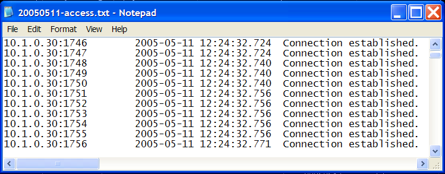

# Supervisión de registros de auditoría{#monitoring-audit-logs}

{{eol}}

Los archivos de registro de auditoría rastrean todos los intentos de conexión y desconexión desde Insight Server, cada uno de los cuales está registrado en la `<YYYYMMDD>-access.txt` archivos ubicados de forma predeterminada en la carpeta Audit dentro del directorio de instalación de Insight Server.

**Frecuencia recomendada:** Diario o según sea necesario para la resolución de problemas

Los registros de auditoría pueden ser muy útiles a la hora de solucionar problemas relacionados con [!DNL Insight Server]. Puede monitorizar estos registros con la herramienta de administración automatizada o viendo la [!DNL access.txt] directamente.

**Para ver los archivos access.txt a través de la variable[!DNL Server Files Manager]**

1. En [!DNL Insight], en el [!DNL Admin] > [!DNL Dataset and Profile] , haga clic en la pestaña **[!UICONTROL Servers Manager]** miniatura para abrir el espacio de trabajo del Administrador de servidores.
1. Haga clic con el botón derecho en el icono de un activo [!DNL Insight Server] y haga clic en **[!UICONTROL Server Files]**.
1. En el [!DNL Server Files Manager], haga clic en **[!UICONTROL Audit]** para ver su contenido.
1. Haga clic con el botón derecho en la marca de verificación de la *nombre del servidor* junto al archivo deseado y haga clic en **[!UICONTROL Make Local]**. Aparece una marca de verificación junto al nombre del archivo en la [!DNL Temp] para abrir el Navegador.
1. Haga clic con el botón derecho en la nueva marca de verificación de la [!DNL Temp] y haga clic en **[!UICONTROL Open]** > **[!UICONTROL in Notepad]**. El registro de auditoría aparece en una nueva ventana del Bloc de notas de Microsoft Windows.

   
