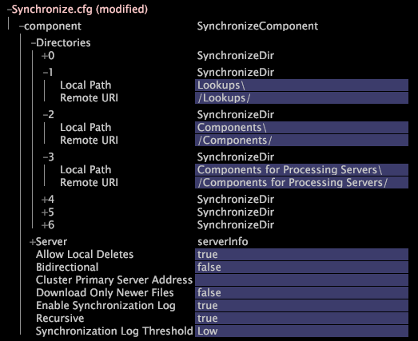

# Añadir una FSU de Insight Server a un clúster existente{#adding-an-insight-server-fsu-to-an-existing-cluster}

Es posible que desee agregar una FSU de Insight Server a un clúster existente si desea almacenar datos de origen en un servidor de archivos adicional o si desea configurar una copia de seguridad para el servidor maestro de Insight Server.

Para agregar un [!DNL Insight Server] FSU a un clúster existente, debe realizar los siguientes procedimientos:

1. [Actualización de los archivos de configuración en el servidor maestro](../../../../../home/c-inst-svr/c-install-ins-svr/c-ins-svr-clstrs/c-add-ins-svrs-ex-clstr/c-add-fsu-ex-clstr.md#section-b5f21f2edb35493da4475de2cdeefca1)
1. [Instalación de la nueva FSU de Insight Server](../../../../../home/c-inst-svr/c-install-ins-svr/c-ins-svr-clstrs/c-add-ins-svrs-ex-clstr/c-add-fsu-ex-clstr.md#section-dddad299dd8642aa91cbe19a395ef3f4)
1. [Configuración de la nueva FSU de Insight Server](../../../../../home/c-inst-svr/c-install-ins-svr/c-ins-svr-clstrs/c-add-ins-svrs-ex-clstr/c-add-fsu-ex-clstr.md#section-c39334c5bd754d5b98d41ad094333108)

## Actualización de los archivos de configuración en el servidor maestro {#section-b5f21f2edb35493da4475de2cdeefca1}

En [!DNL Insight], abra el [!DNL Server Files Manager] para el maestro [!DNL Insight Server] (generalmente un [!DNL Insight Server] FSU) y haga lo siguiente para cada FSU que desee agregar al clúster:

1. Edite el archivo de dirección en el archivo maestro [!DNL Insight Server] para incluir el nombre y la dirección del nuevo FSU tal como se describe al [Añadir los servidores de perspectiva de procesamiento en el archivo](../../../../../home/c-inst-svr/c-install-ins-svr/c-ins-svr-clstrs/c-inst-ins-svr-clstr/c-inst-proc-clstr/c-config-mstr-ins-svr-clstr.md#section-2fe5298180164e8dbaa59ea6b6ff682d)de dirección. Añada el nombre y la dirección de la nueva FSU en el grupo en el que [!DNL Insight Servers] aparece la lista actual del clúster.

1. Edite el archivo control de acceso en el archivo maestro [!DNL Insight Server] para incluir la dirección IP del nuevo FSU, tal como se describe en [Actualización del archivo Control de acceso de un clúster](../../../../../home/c-inst-svr/c-install-ins-svr/c-ins-svr-clstrs/c-inst-ins-svr-clstr/c-inst-proc-clstr/c-config-mstr-ins-svr-clstr.md#section-fce1367d92a445168c35e9ca506e7d6b).

## Instalación de la nueva FSU de Insight Server {#section-dddad299dd8642aa91cbe19a395ef3f4}

1. En su FSU actual, haga un archivo zip del directorio de instalación y copie el archivo en la nueva FSU. [!DNL Insight Server]
1. Descomprima el archivo en la ubicación donde desee colocar el [!DNL Insight Server] software.
1. Descargue e instale el certificado digital para la nueva FSU como se describe en [Descarga e instalación de certificados](../../../../../home/c-inst-svr/c-install-ins-svr/t-install-proc-inst-svr-dpu/c-dnld-dgtl-cert/c-dnld-dgtl-cert.md#concept-4f79c240492f4e52b6375b4b3bbefa17)digitales.
1. Configure los parámetros de utilización de memoria de Windows en la nueva FSU.
1. Cambie el nombre del [!DNL .address] archivo para que refleje el nombre del FSU como se describe en [Definición de la ubicación](../../../../../home/c-inst-svr/c-install-ins-svr/t-install-proc-inst-svr-dpu/c-svrs-ntwk-loc/c-svrs-ntwk-loc.md#concept-87dd2aa3448c415ca1285bc445a8c649)de red del servidor.

1. Si la estructura de la unidad en la nueva FSU es diferente a la del FSU principal, debe editar el [!DNL Disk Files.cfg] archivo.

   1. Abra el [!DNL Disk Files.cfg] archivo en la nueva FSU.
   1. Actualice la configuración para que coincida con las unidades del FSU principal como se describe en [Monitoreo del espacio](../../../../../home/c-inst-svr/c-admin-inst-svr/c-mntr-disk-spc/t-mntr-dtst-data-spc.md#task-6223fa2c718845678824a0a96df96a03)de datos del conjunto de datos.
   1. Guarde el archivo localmente y en el servidor.

1. Regístrese [!DNL Insight Server] como un servicio de Windows en el nuevo equipo FSU tal como se describe en [Registro de Insight Server como un servicio](../../../../../home/c-inst-svr/c-install-ins-svr/t-install-proc-inst-svr-dpu/c-reg-wdws-svc.md#concept-f2c7aa891d544a2595aa01d0d796a540)de Windows.

1. Repita los pasos del 1 al 6 para cada FSU adicional que agregue al clúster.

## Configuración de la nueva FSU de Insight Server {#section-c39334c5bd754d5b98d41ad094333108}

Los siguientes procedimientos proporcionan instrucciones para tareas de configuración específicas. Siga las instrucciones que sean apropiadas para la implementación de la nueva FSU.

**Para configurar la FSU para el almacenamiento de datos de origen**

Si la nueva FSU almacena datos de origen adicionales para el conjunto de datos que se ejecuta en el clúster, debe completar el proceso de configuración del servidor de archivos como se describe en Configuración de una unidad de servidor de [!DNL Insight Server] archivos en el capítulo Archivo de configuración de procesamiento de registros de la Guía *de configuración de* Dataset.

**Para hacer a la nueva FSU la copia de seguridad para la[!DNL Insight Server]FSU maestra**

Si desea hacer de la nueva FSU la copia de seguridad para el maestro [!DNL Insight Server] (que sirve como FSU para el clúster), debe modificar el archivo de sincronización en la nueva FSU (copia de seguridad) para que se sincronice con la FSU maestra.

1. En el [!DNL Insight Server] FSU de copia de seguridad, utilice el [!DNL Server Files Manager] para copiar el [!DNL Synchronize.cfg] archivo de la [!DNL Components for Processing Servers] carpeta en la [!DNL Components] carpeta.

1. Abra el [!DNL Synchronize.cfg] archivo (en la [!DNL Components] carpeta) en [!DNL Insight].

1. Busque el objeto SynchronizeDir que especifica la ubicación del directorio Components. Es posible que haya varios directorios de sincronización en Directorios, por lo que puede que tenga que realizar la vista del contenido de muchos de ellos (haciendo clic en el número de servidor) para encontrar el servidor deseado).
1. Edite la entrada SynchronizeDir y agregue una segunda entrada SynchronizeDir como se muestra en el ejemplo siguiente.

   

1. Guarde el archivo modificado con un nombre nuevo como [!DNL FSU_Synchronize.cfg] para no confundirlo con los [!DNL Synchronize.cfg] archivos de los DPU del clúster.

1. Utilice [!DNL Server Files Manager] para guardar la copia local del archivo renombrado en el servidor. El FSU de copia de seguridad descarga los archivos de los directorios identificados del [!DNL Insight Server] FSU maestro y recupera dinámicamente copias actualizadas de estos archivos del [!DNL Insight Server] FSU maestro cuando cambian.

