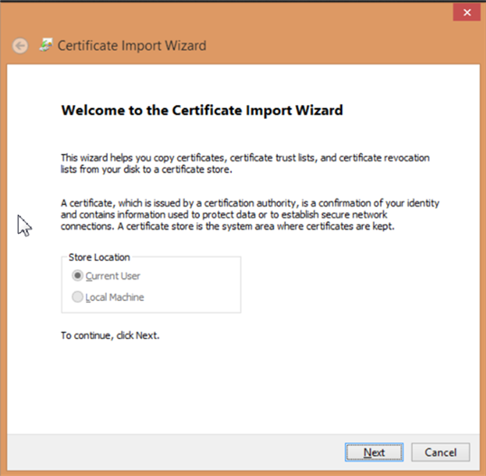

# Descarga e instalación del certificado digital{#downloading-and-installing-the-digital-certificate}

{{eol}}

Una vez instalados los archivos de programa de Insight, debe descargar e instalar el certificado digital que le proporciona el Adobe.

## Descarga e instalación del certificado digital {#topic-fed3b44e472c4e4ca6dd5852af14cdb9}

Una vez instalados los archivos de programa de Insight, debe descargar e instalar el certificado digital que le proporciona el Adobe.

## Explicación de los certificados digitales {#concept-9eed01c8d95440cda6ce29d68e65098c}

Adobe utiliza certificados digitales X.509 para identificar y autenticar los componentes de cliente y servidor que conforman una implementación.

<!--
c_undst_dgtl_crtf.xml
-->

Al instalar Insight, debe instalar el certificado digital que autoriza a un individuo con nombre (por ejemplo, Jane Smith) a utilizar la aplicación cliente instalada.

>[!NOTE]
>
>Si necesita migrar Insight a otro equipo u otro usuario con nombre, debe obtener un nuevo certificado de Adobe. Para ello, contacte con el Servicio de atención al cliente de Adobe.

Insight presenta este certificado digital para obtener acceso a un componente de servidor. Un administrador de un componente de servidor puede restringir el acceso a los recursos del servidor en función del nombre común o los valores de unidad organizativa que aparecen en el certificado del usuario.

Los certificados digitales X.509 instalados con las aplicaciones de Adobe también permiten que sus componentes de cliente y servidor intercambien información a través de Secure Sockets Layer (SSL). SSL asegura las transmisiones a través de HTTP mediante un sistema de cifrado de claves públicas y privadas. La implementación de SSL por parte de Adobe admite claves RSA de 1024 bits y utiliza un algoritmo de cifrado RC4 de 128 bits.

Además de la seguridad, el certificado digital que instala también funciona como una clave de licencia que le permite ejecutar Insight. Para funcionar correctamente, un certificado digital debe estar bloqueado por nodos y ser actual, o la aplicación no se iniciará.

## Certificados bloqueados por nodos {#section-984aa8f2f5a1448cadc4afea978aedc9}

Un certificado bloqueado por nodos es un certificado digital que se ha registrado en el equipo en el que está instalado. El bloqueo de nodos asocia permanentemente un certificado con un identificador de nodo específico (un valor que identifica de forma exclusiva a un equipo concreto). Para que el nodo bloquee el certificado, el equipo debe tener acceso a Internet al servidor de licencias de Adobe o a un servidor proxy que tenga acceso al servidor de licencias.

Si está realizando la instalación en un equipo que no puede acceder a Internet, debe obtener e instalar un certificado prebloqueado especial, tal como se describe en [Uso de certificados digitales en equipos sin acceso a Internet](../../../home/c-install-insight/install-setup/c-dgtl-crtf.md#section-d3c060131d7f45cda27f68848b704fa1).

Si está realizando la instalación en un equipo que puede acceder a Internet, el certificado digital se bloqueará automáticamente la primera vez que inicie Insight. Después de estar bloqueado por nodos, el certificado no se puede usar en ningún otro equipo. Si necesita migrar Insight a otro equipo, debe obtener un certificado nuevo y desbloqueado del Adobe.

## Certificados actuales {#section-0816b031df3e415ab3f0205b720c723e}

Además de estar bloqueado por nodos, el certificado digital debe estar actualizado. Para mantenerse actualizado, el certificado debe volverse a validar de forma regular (generalmente cada 30 días, pero puede variar según el acuerdo con Adobe). Si el equipo tiene acceso a Internet, el proceso de revalidación es completamente transparente. Insight se conecta automáticamente al servidor de licencias y vuelve a validar el certificado cuando es necesario. Si el equipo no tiene acceso a Internet, debe instalar manualmente un certificado actualizado, tal como se describe en la sección siguiente.

## Uso de certificados digitales en equipos sin acceso a Internet {#section-d3c060131d7f45cda27f68848b704fa1}

Si está realizando la instalación en un equipo que no puede acceder a Internet, debe solicitar un certificado prebloqueado para la instalación de Insight. Un certificado prebloqueado es un certificado digital cuyo Adobe se bloquea manualmente al identificador de nodo del equipo.

Para solicitar un certificado prebloqueado, debe enviar el identificador de nodo y el número de certificado al Servicio de atención al cliente de Adobe. Para obtener el identificador de nodo de su equipo, póngase en contacto con el Servicio de atención al cliente de Adobe para solicitar el Adobe [!DNL Node Identifier] utilidad. También puede obtener el identificador de nodo de la alerta que Insight genera cuando intenta conectarse al servidor de licencias y no puede hacerlo. Cuando reciba el certificado prebloqueado, instálelo tal como se describe en los dos últimos pasos de [Instalación de certificados digitales](../../../home/c-install-insight/install-setup/c-dgtl-crtf.md#task-1dad1e1d86d04100a7bcf87f26303c38).

Cuando sea necesario volver a validar el certificado, debe descargar un certificado nuevo y validado del servidor de licencias y volver a instalarlo en el equipo (a menos que el acuerdo con el Adobe indique lo contrario).

## Instalación de certificados digitales {#task-1dad1e1d86d04100a7bcf87f26303c38}

<!--
t_install_dgtl_crtf.xml
-->

**Para descargar e instalar el certificado digital**

1. Abra el explorador web para [!DNL https:\\license.visualsciences.com].

   >[!NOTE]
   >
   >Es posible que el explorador le pida que presente un certificado digital en este momento. Si es así, haga clic en **[!UICONTROL Cancel]** para cerrar el cuadro de diálogo.

1. En la pantalla de inicio de sesión, introduzca el [!DNL Account Name] y el [!DNL Password] que recibió de Adobe y, a continuación, haga clic en **[!UICONTROL login]**.
1. Busque el certificado emitido para la instancia de Insight ( *Su nombre*.pem) y haga clic en el botón  asociado a ese certificado.
1. Cuando se le pregunte si desea guardar el certificado, haga clic en **[!UICONTROL Save]**.
1. Descargue el archivo a la [!DNL Certificates] en el directorio donde instaló Insight.

   Esta carpeta contiene un archivo de certificado denominado [!DNL trust_ca_cert.pem]. Ambos archivos de certificado siempre deben estar presentes para que Insight funcione.

## Almacén de certificados de Windows {#concept-4acb13b7de9340ea8cde8ad84b93358d}

El Almacén de certificados de Windows le permite almacenar el certificado y la clave privada del cliente en el Almacén de certificados de Windows para la comunicación SSL con los servidores.

<!--
crypto-api.xml
-->

El Almacén de certificados de Windows para el cliente es una nueva funcionalidad que permite almacenar el certificado de comunicación SSL y la clave privada en el Almacén de certificados de Windows en lugar de en el archivo `Insight/Certificates/<CertName>.pem`. Puede que sea preferible utilizar el Almacén de certificados de Windows si utiliza el almacén de certificados para otras aplicaciones y desea realizar la administración de certificados en un lugar o para usuarios que disfrutan del registro de auditoría de Windows adicional que proporciona el Almacén de certificados de Windows.

>[!NOTE]
>
>Las licencias con el servidor de licencias aún se mantienen mediante el archivo `<Common Name>.pem` existente y el certificado obtenido del almacén de certificados solo se utilizará para la comunicación con los servidores especificados.

## Requisitos previos {#section-69b18600052145ff8e5299b7123e69c5}

1. Debe tener acceso al archivo [!DNL certmgr.msc] con la capacidad de importar un certificado y una clave en el almacén **personal**. (Esto debería ser así de forma predeterminada para la mayoría de los usuarios de Windows).

1. El usuario que realiza la configuración debe tener una copia de la herramienta de línea de comandos **OpenSSL**.
1. El servidor y el cliente ya deben estar configurados para usar un certificado SSL personalizado, dando instrucciones para almacenar el certificado de cliente en el almacén de certificados de Windows en lugar de almacenarlo en el **Certificados** directorio.

## Configuración del Almacén de certificados de Windows {#section-3629802122e947d4b4f63e8b732cfe27}

El Almacén de certificados de Windows para clientes está habilitado siguiendo estos pasos:

**Paso 1: Importe el certificado SSL y la clave privada del usuario en el Almacén de certificados de Windows.**

En [Uso de certificados personalizados en la Data Workbench](../../../home/c-install-insight/install-setup/c-dgtl-crtf.md#concept-ee6a9b5015f84a0ba64a11428b0a72dd) se le indica que coloque el certificado SSL y la clave en el siguiente directorio:

```
<
<filepath>
  DWB Install folder
</filepath>>\Certificates\
```

El nombre del certificado es `<Common Name>.pem` como Analytics Server 1.pem (no el archivo trust_ca_cert.pem).

Para poder importar el certificado y la clave privada, deben convertirse desde el formato . [!DNL pem] a un formato [!DNL .pfx], como [!DNL pkcs12.pfx]).

1. Abra un símbolo del sistema o terminal y vaya al directorio:

   ```
   <CommonName>.pem c: cd \<filepath>DWB Install folder</filepath>>\Certificates
   ```

1. Ejecute [!DNL openssl] con los siguientes argumentos (con el nombre real del archivo [!DNL .pem]):

   ```
   openssl pkcs12 -in "<Common Name>.pem" -export -out "<Common Name>.pfx"
   ```

   Si se le solicita, pulse **Intro** para omitir la introducción de una contraseña de exportación.

1. Ejecute [!DNL certmgr.msc] desde la línea de comandos, el menú de inicio o el símbolo del sistema.
1. Abra el almacén de certificados **personales** para el usuario actual.

   

1. Haga clic con el botón secundario en **Certificados** y, a continuación, haga clic en **Todas las tareas** > **Importar**.

   Asegúrese de que la opción **Usuario actual** está seleccionada y haga clic en **Siguiente**.

   

1. Haga clic en **Examinar** y seleccione el archivo `<CommonName>.pfx` que creó anteriormente. Para poder verlo, deberá cambiar el cuadro desplegable de extensión de archivo de un certificado X.509 a **Intercambio de información personal** o a **Todos los archivos**.

   Seleccione el archivo y haga clic en **Abrir** y, a continuación, en **Siguiente**.

1. No introduzca una contraseña y asegúrese de que solo están seleccionadas las opciones **Marcar esta clave como exportable** e **Incluir todas las propiedades extendidas**.

   

   Haga clic en **Siguiente**.

1. Asegúrese de que está seleccionada la opción **Colocar todos los certificados en el almacén siguiente** y que el almacén de certificados que aparece es **Personal**. (Si es un usuario avanzado, puede seleccionar otro almacén en este momento, pero tendrá que cambiar la configuración más adelante).

1. Haga clic en **Siguiente** y, a continuación, en **Finalizar**. Debe ver un cuadro de diálogo que le indica que la importación se ha realizado correctamente y ver el certificado en la carpeta Certificados del almacén.

   >[!NOTE]
   >
   >Preste especial atención a los campos **Emitidos a** y **Emitidos por**. Los necesitará en el próximo paso.

**Paso 2: Editar el archivo Insight.cfg.**

El archivo [!DNL Insight.cfg] debe editarse para dirigir Data Workbench para que use la función Almacén de certificados de Windows. Cada entrada de servidor de este archivo debe tener algunos parámetros adicionales especificados. Si se omiten los parámetros, la estación de trabajo utilizará de forma predeterminada la configuración de certificado existente. Si los parámetros están especificados pero tienen valores incorrectos, la estación de trabajo introducirá un estado de error y deberá consultar el archivo de registro para obtener información sobre el error.

1. Abra el archivo **Insight.cfg** (ubicado en el directorio de instalación de **Insight**).

1. Vaya hasta la entrada de servidor que desee configurar. Si desea utilizar el Almacén de certificados de Windows para cada servidor, debe realizar estas modificaciones en cada entrada del vector de objetos [!DNL serverInfo].
1. Añada estos parámetros a su archivo [!DNL Insight.cfg]. Puede hacerlo desde la estación de trabajo o manualmente agregando los siguientes parámetros al objeto [!DNL serverInfo]. (Asegúrese de utilizar espacios en lugar de caracteres de tabulación y no cometa otros errores tipográficos o de sintaxis en este archivo).

   ```
   SSL Use CryptoAPI = bool: true
   SSL CryptoAPI Cert Name = string: <Common Name>
   SSL CryptoAPI Cert Issuer Name = string: Visual Sciences,LLC
   SSL CryptoAPI Cert Store Name = string: My
   ```

   El valor booleano activa o desactiva la función. El nombre del certificado coincide con **Emitido a** en el administrador de certificados. El nombre del emisor del certificado coincide con **Emitido por** y el **Nombre del almacén** debe coincidir con el nombre del almacén de certificados.

   >[!NOTE]
   >
   >El nombre “Personal” en el Administrador de certificados (certmgr.msc) hace referencia al almacén de certificados denominado **My.** En consecuencia, si importa el certificado de comunicación SSL y la clave (.PFX) en el almacén de certificados **Personal**, tal y como se recomienda, debe establecer la cadena **SSL CryptoAPI Cert Store Name** en “My”. Si establece este parámetro en “Personal”, no funcionará. Es una característica del Almacén de certificados de Windows.

   Aquí puede obtener una lista completa de los almacenes de sistemas predefinidos: [https://msdn.microsoft.com/en-us/library/windows/desktop/aa388136(v=vs.85).aspx](https://msdn.microsoft.com/en-us/library/windows/desktop/aa388136%28v=vs.85%29.aspx). Es posible que el sistema tenga almacenes de certificados adicionales. Si desea utilizar un almacén que no sea “Personal” (como **My**), debe obtener el nombre canónico del almacén de certificados y proporcionarlo en el archivo [!DNL Insight.cfg]. (El nombre del almacén de sistemas “My” se denomina como “My” y “MY” en la documentación de Windows. El parámetro no parece distinguir entre mayúsculas y minúsculas).

1. Después de agregar estos parámetros y comprobar que los valores coinciden con la lista en el Administrador de certificados de Windows, guarde el archivo [!DNL Insight.cfg].

Ahora puede iniciar la estación de trabajo (o desconectar/volver a conectar con el servidor). Data Workbench debe cargar el certificado y la clave desde el almacén de certificados y conectarse normalmente.

## Salida de registro {#section-a7ef8c9e90ef4bbabaa3cd51a2aca3ab}

Cuando no se encuentra un certificado o no es válido, se envía este mensaje de error al archivo [!DNL HTTP.log].

```
ERROR Fatal error: the cert could not be found!
```

>[!NOTE]
>
>El marco de registro L4 puede habilitarse configurando el archivo [!DNL L4.cfg] (consulte con el administrador de cuentas para configurarlo).

## Uso de certificados personalizados en Data Workbench {#concept-ee6a9b5015f84a0ba64a11428b0a72dd}

Instrucciones para usar certificados personalizados.

<!--
using-custom-certificates-DWB.xml
-->

Un certificado utilizado por el cliente de Data Workbench o el servidor debe estar firmado por una CA de confianza (entidad emisora de certificados). Los clientes de Data Workbench reciben certificados firmados por Visual Sciences CA. Estos certificados son de confianza para el software de Data Workbench, ya que la variable [!DNL trust_ca_cert.pem] (se proporciona junto con el software de Insight y se almacena en la variable **Certificados** directorio de tanto servidores como clientes) contiene un *Certificado CA raíz* para Visual Sciences CA. Estos certificados se utilizan tanto para la licencia del software como para la autenticación cuando los clientes y servidores se comunican entre sí mediante SSL. Sólo los certificados emitidos por Visual Sciences CA pueden utilizarse para la concesión de licencias, pero otros certificados pueden utilizarse para la comunicación y la autenticación. Los certificados emitidos por entidades emisoras distintas de Visual Sciences se mencionan a continuación como *certificados personalizados.*

**Nota importante:** Para servidores y clientes, el software de Data Workbench utiliza los archivos de certificado instalados en el cliente o el servidor **Certificados** directorio o certificados explícitamente identificados en su configuración. Sin embargo, también puede usar el Almacén de certificados de Windows para clientes.

Las siguientes instrucciones describen los procedimientos que se deben seguir para utilizar certificados personalizados para la comunicación entre clientes de Data Workbench y servidores. No todos los detalles son un requisito difícil y se pueden utilizar diferentes variaciones en el proceso. Sin embargo, los procedimientos que figuran a continuación se han puesto a prueba para que funcionen.

## Configuración de certificados de cliente personalizados {#section-2083fd41973e451fa404e7a4ae4da591}

1. Agregue el certificado de la CA emisora al [!DNL trust_cert_ca.pem], que se instala en el **Certificados** del cliente y del de cada servidor de cada clúster al que se vaya a acceder mediante este certificado personalizado.

1. Obtenga un certificado personalizado para cada servidor del clúster con las siguientes condiciones:

   1. El certificado tiene el formato de [!DNL .pem] certificado.
   1. El certificado contiene su clave y no está cifrado (es decir, no tiene ninguna frase de contraseña/contraseña).

      Un certificado contiene su clave con una de las siguientes líneas:

      ```
      BEGIN PRIVATE KEY
      BEGIN RSA PRIVATE KEY
      ```

      Una forma de quitar la frase de contraseña de una [!DNL .pem] certificado:

      ```
      openssl rsa  -in password-protected-cert.pem -out no-password-cert.pem
      openssl x509 -in password-protected-cert.pem >> no-password.pem
      ```

   1. El certificado tiene las letras CN, O, OU, etc. según sea necesario para este cliente en los servidores de [!DNL Access Control.cfg] archivo.
   1. El certificado se emitió con un *propósito&#42;&#42;&#42;* de *cliente* (o ambas *server* **y** *cliente*).

      Para verificar que un certificado tiene un código de propósito de servidor o cliente, se pueden utilizar los siguientes comandos:

      ```
      openssl verify -CAfile trust_ca_cert.pem -purpose sslserver -x509_strict custom_communications_cert.pem
      openssl verify -CAfile trust_ca_cert.pem -purpose sslclient -x509_strict custom_communications_cert.pem
      ```

      Para los certificados de servidor, ambos comandos deben arrojar:

      ```
      custom_communications_cert.pem: OK
      ```

      Para un certificado de cliente, solo se requiere el segundo comando para generar [!DNL OK].

1. Coloque el certificado en el **Certificados** directorio.
1. En [!DNL Insight.cfg] en el *serverInfo* para cada clúster que desee utilizar este certificado, asegúrese de que la variable *certificado de cliente personalizado* tiene un nombre, como:

   ```
   Servers = vector: 1 items
     0 = serverInfo:
       SSL Client Certificate = string:
     <my_custom_client_cert.pem>
   ```

## Configuración de certificados de servidor personalizados {#setting-up-custom-server-certificates}

En esta sección se asume que tiene un clúster que está en funcionamiento, que utiliza certificados emitidos por Visual Sciences y que la configuración sigue prácticas comunes (como la *Componentes para servidores de procesamiento* el directorio del maestro se sincroniza con el *Componentes* directorios de todas las DPU).

1. Agregue el certificado de la CA emisora al [!DNL trust_cert_ca.pem] que se instala en todos los servidores del clúster y en todos los clientes que necesitan comunicarse con este clúster.
1. Obtenga un certificado personalizado para cada servidor del clúster con estos requisitos:

   1. El certificado personalizado tiene el formato de [!DNL .pem] certificado.
   1. El certificado contiene su clave y no está cifrado (es decir, no tiene ninguna frase de contraseña/contraseña).

      Un certificado contiene su clave si tiene una línea como:

      ```
      BEGIN PRIVATE KEY
      BEGIN RSA PRIVATE KEY
      ```

      Una forma de quitar la frase de contraseña de una [!DNL .pem] certificado:

      ```
      openssl rsa  -in password-protected-cert.pem -out no-password-cert.pem
      openssl x509 -in password-protected-cert.pem >> no-password.pem
      ```

   1. El certificado tiene el mismo CN que el [!DNL server_cert.pem] instalado actualmente en el servidor.
   1. El certificado se expidió con el fin de *server* y *cliente*.

      Para verificar que un certificado tiene un código de propósito de servidor o cliente, se pueden utilizar los siguientes comandos:

      ```
      openssl verify -CAfile trust_ca_cert.pem -purpose sslserver -x509_strict custom_communications_cert.pem
      openssl verify -CAfile trust_ca_cert.pem -purpose sslclient -x509_strict custom_communications_cert.pem
      ```

      Para los certificados de servidor, ambos comandos deben arrojar:

      ```
      custom_communications_cert.pem: OK
      ```

      Para un certificado de cliente, solo se requiere el segundo comando para generar [!DNL OK].

1. Instale cada certificado personalizado del servidor en la variable **Certificados** directorio del servidor como [!DNL custom_communications_cert.pem].

1. Con un editor de texto, agregue la línea siguiente a **Communications.cfg** en *Componentes* y *Componentes para servidores de procesamiento* directamente debajo de la primera línea ( [!DNL component = CommServer]):

   ```
   Certificate = string: Certificates\\custom_communications_cert.pem
   ```

1. Reinicie todos los servidores.

**Acerca de la advertencia de errores de certificados**

Cuando el servidor o cliente de Insight está buscando un **licencia** en el **Certificados** , intenta validar todos los certificados (excepto [!DNL trust_ca_cert.pem]), frente a una copia codificada del certificado de Insight CA, que falla en cualquier certificado personalizado presente en el directorio. El servidor emite esta advertencia:

```
Certificate failed to verify. Error 20 at 0 depth. Desc: unable to get local issuer certificate. Cert details:
```

Esta advertencia se puede ignorar con seguridad.

## Cifrado de cadenas {#concept-35da0b53650a4d7e82b240ad27f6d45a}

Codifique contraseñas y otras cadenas al realizar comunicaciones entre el cliente y el servidor.

<!--
string_encryption.xml
-->

Al comunicarse entre el cliente de Data Workbench (estación de trabajo) y el servidor, puede guardar un parámetro Value (como una contraseña) con el Tipo de *EncryptedString*. Esto oculta el parámetro y guarda la cadena en la variable *Almacén de credenciales de Windows* en el servidor con la clave correspondiente devuelta. Esto almacena principalmente las credenciales utilizadas en las exportaciones, pero puede utilizarse para cifrar cualquier parámetro.

* Se ha añadido una nueva carpeta al servidor\**EncryptStrings**.

   Aquí es donde establece el archivo de configuración para cifrar cadenas.

* Se agregó un nuevo archivo de configuración en Server\Component\**EncryptedStrings.cfg**.

   ```
   component = EncryptionComponent:
     Path = Path: EncryptStrings\\*.cfg
   ```

   Este archivo sondea la variable *Servidor* Carpeta \*EncryptStrings* para archivos de configuración de cifrado.

**Para cifrar una cadena**:

1. Cree un **EncryptedStrings.cfg** archivo de configuración de una cadena con estos campos definidos:

   ```
   Names = vector: 1 items
    0 = NameEncryptValuePair:
     EncryptValue = EncryptedString: // left empty as input then output will be filled by server
     Name = string: // Name for identifier
     Value = string: // Value to be encrypted
   ```

   * *Valor* - Este campo contiene la cadena de texto sin formato que debe cifrarse.

      Solo es cifrado del lado del servidor. La variable *Valor* esta configuración solo está cifrada en el equipo servidor.

   * *Nombre* - Este campo contiene un valor que identifica la cadena cifrada.
   * *EncryptValue* - Este campo se deja vacío en el archivo de configuración de entrada. El valor cifrado se devuelve en este campo.

   Puede agregar varias **NameEncryptValuePair** para diferentes campos de codificación.

   >[!NOTE]
   >
   >Se eliminarán todos los campos de valor vacíos.

1. Guarde el **EncryptedStrings.cfg** al servidor\**EncryptStrings** carpeta.

**Archivo de salida**

Se generará un archivo de salida con el mismo nombre que el archivo de entrada con un &lt;*filename*>.*cifrados* extensión. Por ejemplo, si el nombre del archivo de entrada es *sample.cfg* entonces se llamará al archivo de salida *sample.cfg.encryption*.
