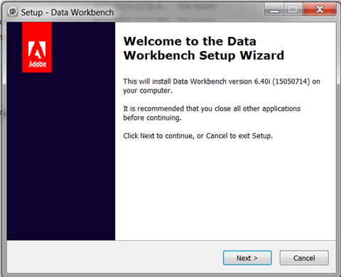

# Asistente de configuración de Workstation{#workstation-setup-wizard}

{{eol}}

Data Workbench proporciona un asistente de configuración para instalar la aplicación de estación de trabajo (cliente).

## Instalación de la estación de trabajo mediante el Asistente para configuración {#section-58da9bb6196c46eab3b54146913fdcb8}

Inicie el ejecutable del asistente de instalación y siga cada paso para instalar el programa cliente de la estación de trabajo. Después de la instalación de la estación de trabajo, puede conectarse a servidores y perfiles.

1. Haga doble clic en el ejecutable del instalador de la estación de trabajo.
1. Haga clic en **Sí** para permitir que el programa se instale en Windows.
1. Seleccione un **Idioma** para el asistente de configuración.

   Se abrirá el asistente:

   

1. Haga clic en **Siguiente** en el **Asistente para la configuración de Datas Workbench** diálogo.

1. Seleccione para instalar un **Nueva instalación** o **Actualizar o reparar** una instalación existente.

   **Nueva instalación** sobrescribe los archivos instalados anteriormente.

   **Actualización** actualiza la estación de trabajo a la versión más reciente o le permite reparar una instalación existente. Data Workbench se comparará instalada **Insight.exe** y ejecute el Asistente para configuración de Workstation si hay disponible una versión más reciente del cliente.

1. Seleccione la ubicación de instalación:

   **Típico** se instala en una carpeta y una ubicación predeterminadas.

   * Los archivos de programa se guardan de forma predeterminada en:

      ```
      C:\Program Files\Adobe\Adobe Analytics\Data Workbench
      ```

   * Los archivos de datos (perfiles, certificados, registros de seguimiento y archivos de usuario) se guardan de forma predeterminada en:

      ```
      C:\Users\<username>\AppData\Local\Adobe\Adobe Analytics\Data Workbench\
      ```

      >[!IMPORTANT]
      >
      >Un genérico ***Insight.cfg*** archivo sin detalles del servidor se instalará inicialmente. Se recomienda utilizar el ***Insight.cfg*** y personalícelo en lugar de mover un archivo desde una instalación anterior. Debido a que la ruta para instalar la estación de trabajo ha cambiado, la adición de fuentes, la eliminación del *Carpeta de usuario*, y se recomienda eliminar *TraceFileComponent *.

1. (opcional) Seleccione **Personalizado** para elegir el paquete de idioma y la ubicación del programa y los archivos de datos.
1. Seleccionar ubicación para **accesos directos en el menú Inicio**.

   

   Haga clic en **No crear una carpeta del menú Inicio** para no instalar un acceso directo en el menú de inicio de Windows.

1. Haga clic en **Siguiente.** Se mostrará un resumen de las rutas y los idiomas de ubicación de archivos seleccionados. Haga clic en **Instalar.**

1. Busque la variable **Certificado de Data Workbench**.

   Si el asistente de configuración no encuentra el certificado de Data Workbench durante la instalación, abrirá un cuadro de diálogo para buscar la ubicación del certificado (una **.pem** archivo ubicado de forma predeterminada en el cliente **Certificados** carpeta) o haga clic en **Omitir** para buscar el certificado después de la instalación.

   Haga clic en **Instalar** después de localizar el certificado.

1. Una vez que se haya completado el asistente de configuración y haya instalado la Data Workbench, haga clic en **Finalizar** para completar la configuración.

   >[!NOTE]
   >
   >La ubicación de registro predeterminada para el Asistente para configuración de la estación de trabajo en  `C:\Users\<userName>\AppData\Local\Temp`.

   Seleccione el **Aplicación de inicio** para abrir el área de trabajo después de la configuración.

1. **Configuración de conexiones** a servidores en **[!DNL Insight.cfg]** archivo.

   Después de la instalación de la estación de trabajo, se abrirá el espacio de trabajo Experiencia de configuración de la estación de trabajo mejorada con información adicional sobre [introducción de información de conexión del servidor](/help/home/c-get-started/c-insght-config-param.md) en el *Insight.cfg* y una opción para seleccionar un perfil en la lista desplegable. También puede ver el estado de conexión a los servidores.

   

## Carpetas de instalación {#section-b5ea5a3b3ecb4622aef713972f3f8ebd}

La estructura de carpetas de Data Workbench tiene dos ubicaciones de instalación:

* **Archivos de programa** La variable **Insight.exe** y archivos de cliente compatibles (**Insight.ini**) ahora se encuentra de forma predeterminada en

   ```
   C:\Program Files\Adobe\Analytics\DataWorkbench
   ```

* La variable **Appdata** carpeta.

   **Insight.cfg**, perfiles, certificados, registros de seguimiento y archivos de usuario se encuentran ahora de forma predeterminada en

   ```
   C:\Users\<Winuser>\AppData\Adobe\Analytics\DataWorkbench\ 
   ```

   Puede establecer la ruta para la variable **Appdata** en la carpeta `Insight.ini` archivo:

   ```
   [InitialSettings] 
   AppDataFolder=C:\Users\mhiatt\AppData\Local\Adobe\Adobe Analytics\Data Workbench\ 
   Locale=en-us
   ```

## Desinstalación de la estación de trabajo {#section-5ce2e233fe4348469ef1b3c451dd5b70}

La Data Workbench ahora incluye un ejecutable para desinstalar la estación de trabajo (ubicada de forma predeterminada en **`Program Files\Adobe\Adobe Analytics\Data Workbench\ unins000.exe`**).

Inicie y siga los pasos para eliminar los archivos de la estación de trabajo de Data Workbench de su disco duro.

>[!NOTE]
>
>Puede iniciar el **unins000.exe** del archivo ejecutable de la carpeta, utilizando el **Desinstalar Data Workbench** acceso directo desde el menú Inicio o desde **[!UICONTROL Control Panel]** > **[!UICONTROL Program and Features]**.
