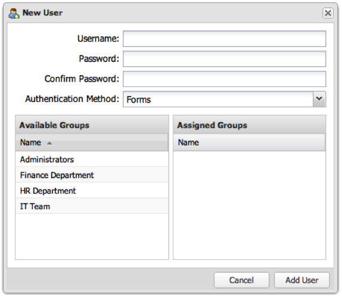

# Añadir una cuenta de usuario{#adding-a-user-account}

1. Haga clic en **[!UICONTROL Add User]** para que aparezca el mensaje **[!UICONTROL New User]**.

   

1. Rellene los campos necesarios para completar el formulario.
   1. **[!UICONTROL Username]**: Introduzca el nombre de usuario.
   1. **[!UICONTROL Password]**: Escriba una contraseña de más de 6 caracteres.
   1. **[!UICONTROL Confirm Password]**: Vuelva a introducir la contraseña.
   1. **[!UICONTROL Authentication Method]**: seleccione una opción en la lista desplegable.

      | **Forms** | De forma predeterminada, el panel almacena la cuenta de usuario y se autentica internamente. |
      |---|---|
      | **LDAP** | Seleccione esta opción si el usuario se va a autenticar mediante LDAP. (El usuario ya debe existir en el directorio ). |
      | **Windows** | Seleccione si se va a autenticar al usuario mediante la autenticación de Windows (el usuario debe existir ya en el directorio de Windows). |

1. **[!UICONTROL Assigned Groups]**: Elija entre el grupo Administradores predeterminado y cualquier otro grupo que se haya creado. En este momento no se requiere ningún grupo y la pertenencia al grupo del usuario se puede modificar en cualquier momento.
1. Una vez configurado correctamente el formulario, haga clic en **[!UICONTROL Add User]** para agregar el usuario al sistema.

   Si la operación se ha realizado correctamente, verá un mensaje que indicará que se ha creado el usuario.
