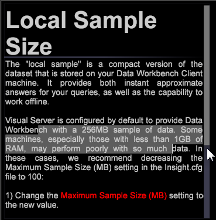

# Actualización de Área de trabajo de datos 6.21{#data-workbench-update}

Área de trabajo de datos 6.2.1 proporciona nuevas funciones y correcciones de errores.

## Nuevas funciones {#section-1aacfe9a6a964c91b1d24fc1b181db34}

Área de trabajo de datos 6.2.1 incluye estas nuevas funciones:

<table id="table_E28A6D31E7D941F7A0C2048F0F0F7838"> 
 <thead> 
  <tr> 
   <th colname="col1" class="entry"> Funciones  </th> 
   <th colname="col2" class="entry"> Descripción </th> 
  </tr> 
 </thead>
 <tbody> 
  <tr> 
   <td colname="col1"> Funciones para las barras de desplazamiento verticales en el texto y de ajuste de texto. </td> 
   <td colname="col2"> Los cuadros de texto ahora tienen barras de desplazamiento verticales y texto de ajuste. 
  
 </td> 
  </tr> 
  <tr> 
   <td colname="col1"> Ordenar miniaturas en la superficie de trabajo </td> 
   <td colname="col2"> Los nombres ordenados en la superficie de trabajo ahora no distinguen entre mayúsculas y minúsculas y ordenan alfabéticamente AaBbCcDd en lugar de ABCDabcd. 
  
 </td> 
  </tr> 
  <tr> 
   <td colname="col1"> Buscar dimensiones en función de la dimensión primaria </td> 
   <td colname="col2"> 
En el panel de buscadores, ahora se puede hacer clic con el botón derecho en la pestaña Dimensiones y seleccionar Tipo de dimensión &gt; Primaria. A continuación se mostrará una lista de las dimensiones contables de nivel superior. Al seleccionar una de las dimensiones primarias, se mostrará una lista de las dimensiones subordinadas en los resultados de búsqueda. 
  </td> 
  </tr> 
  <tr> 
   <td colname="col1"> Diálogo para abrir una aplicación externa </td> 
   <td colname="col2"> 
Ahora se le mostrará un cuadro de diálogo la primera vez que intente abrir una aplicación externa en Área de trabajo de datos. 
 
Por ejemplo, si abre un archivo de texto en el Bloc de notas, recibirá el siguiente mensaje. 
  
Esto también creará un archivo local llamado InsightSES.dat en la carpeta de instalación del cliente. 
 </td> 
  </tr> 
  <tr> 
   <td colname="col1"> Cambiar barras de herramientas a botones </td> 
   <td colname="col2"> Puede dejar de utilizar los nuevos iconos de la barra de herramientas de la versión 6.2. de Área de trabajo de datos cambiando el argumento de Iconos de la barra de herramientas del archivo insight.cfg a false . <code> Toolbar&amp;nbsp;Icons&amp;nbsp;=&amp;nbsp;bool:&amp;nbsp;false&amp;nbsp;&amp;nbsp;&amp;nbsp;&amp;nbsp;&amp;nbsp;&amp;nbsp; </code> 
Tendrá que reiniciar el cliente para aplicar los cambios. 
 </td> 
  </tr> 
  <tr> 
   <td colname="col1"> Se han actualizado las opciones de restablecimiento en Puntuación de tendencia y Árboles de decisión </td> 
   <td colname="col2"> In the <a href="https://docs.adobe.com/content/help/en/data-workbench/using/client/analysis-visualizations/visitor-propensity/c-visitor-propensity.html" format="http" scope="external"> Propensity Scoring </a> (  Tools &gt; Predictive Analytics &gt; Propensity Score ) and the <a href="https://docs.adobe.com/content/help/en/data-workbench/using/client/analysis-visualizations/decision-trees/c-decision-trees.html" format="http" scope="external"> Decision Tree </a> (  Visualizations &gt; Predictive Analytics &gt; Classifications &gt; Decision Tree Builder ) visualizations, you now have two reset options: 
<b>Modelos de reinicio</b>: borra el modelo pero mantiene la configuración y los valores de entrada. Hace que el botón <b>Ir</b> se pueda seleccionar. 
 
<b>Restablecer todo</b>: restablece todos los ajustes (como en el diseño anterior). 
 </td> 
  </tr> 
 </tbody> 
</table>

## Correcciones de errores {#section-8704a9ac358246cd81233dd0982d534f}

* Los archivos **[!UICONTROL Browsers]** y **[!UICONTROL Operating Systems]** de búsqueda no se actualizarán dentro del **[!UICONTROL Traffic]** perfil heredado (por ejemplo, [!DNL Lookups\Traffic\Browsers.txt)]. Instead, configuration of the **[!UICONTROL Traffic]** profile will utilize the DeviceAtlas bundle ( [!DNL Lookups\DeviceAtlas\DeviceAtlas.bundle]) to provide this configuration information.
* La versión 6.2.1 de Área de trabajo de datos será la última que ofrecerá la descarga de la aplicación del cliente de 32 bits. A partir de entonces, las siguientes descargas de la aplicación del cliente serán de 64 bits y también requerirán Windows 7 o una versión posterior. Las limitaciones de memoria de la aplicación de 32 bits quedan corregidas con la aplicación de 64 bits, a partir de la versión 6.1.

   >[!NOTE]
   >
   >La versión de 32 bits de la aplicación cliente de Área de trabajo de datos puede experimentar problemas potenciales relacionados con las limitaciones de memoria al ejecutar modelos predictivos mediante las funciones de clúster y puntuación.

