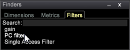

# Buscadores{#finders}

Utilice los paneles Buscador del Área de trabajo de datos para seleccionar métricas, dimensiones y filtros. Estos paneles proporcionan soporte para la búsqueda, opciones de ordenación y funciones de arrastrar y soltar.

Se puede abrir un panel Finder en la barra lateral izquierda o en un espacio de trabajo.

<table id="table_3E43DBA0646842898F14F31374F9E39C"> 
 <thead> 
  <tr> 
   <th colname="col1" class="entry"> Buscador de dimensiones </th> 
   <th colname="col2" class="entry"> Buscador de métricas </th> 
   <th colname="col3" class="entry"> Buscador de filtros </th> 
  </tr>
 </thead>
 <tbody> 
  <tr> 
   <td colname="col1"> 
Una lista de todas las dimensiones del modelo de consulta. 
 </td> 
   <td colname="col2"> 
Una lista de todas las métricas del modelo de consulta. 
 </td> 
   <td colname="col3"> 
Una lista de todos los filtros creados para su organización. 
 </td> 
  </tr> 
 </tbody> 
</table>

**Para abrir un Finder:**

* Haga clic con el botón derecho en un espacio de trabajo y seleccione **[!UICONTROL Tools]** > **[!UICONTROL Finder]**.

   El panel Buscador con fichas para Métricas, Dimensiones y Filtros se abrirá en el espacio de trabajo.

* Haga clic con el botón derecho en la barra lateral izquierda y seleccione **[!UICONTROL Add]** > **[!UICONTROL Finder]**.

   El panel Buscador se abrirá en el panel izquierdo.

El **Finder** incluye las siguientes funciones:

<table id="table_072047E919204577AE85789BAE0F4EE8"> 
 <thead> 
  <tr> 
   <th colname="col1" class="entry"> Funciones del buscador </th> 
   <th colname="col2" class="entry"> Detalles </th> 
  </tr>
 </thead>
 <tbody> 
  <tr> 
   <td colname="col1"><b>Arrastrar y soltar</b> </td> 
   <td colname="col2"> 
 Puede arrastrar y soltar dimensiones o métricas desde el panel a una visualización en el espacio de trabajo para cambiar la dimensión o agregar nuevas métricas. 
 
    <ol id="ol_612DC76EC04C4FCE938B20B388C43CE8"> 
     <li id="li_7F73B781141E4B8CAE9800F580F62E44">Mantenga pulsadas las teclas  &lt;Ctrl&gt; y  &lt;Alt&gt; y seleccione la dimensión o métrica en el panel Buscador. </li> 
     <li id="li_631D57976F71415AA61F33EBBFDD128A">Arrastre una nueva dimensión desde el panel y colóquela en la visualización para cambiar o agregar dimensiones. </li> 
     <li id="li_5329FB82225F46EBBE3A996A641058DE">Para agregar métricas, arrastre una nueva métrica del panel y suéltela en el encabezado de métrica de la visualización seleccionada. </li> 
    </ol> 
Esto funcionará para todas las visualizaciones relevantes, incluidas tablas, clúster de visitantes, matriz de correlación, gráficos de puntos y gráfico de barras 2D (según el eje). 
 </td> 
  </tr> 
  <tr> 
   <td colname="col1"><b>Buscar</b> </td> 
   <td colname="col2">El cuadro  Buscar de los paneles Buscador permite filtrar nombres para dimensiones, métricas y filtros. 
    <ul id="ul_0F6F377E9906472E99008EBE7483F689"> 
     <li id="li_75857895EDB045C8B2960393854B257D"> 
Coincidencia de patrones (búsqueda simple de glob). Empiece a escribir el nombre de una dimensión, métrica o entidad de filtro necesaria en el campo Buscar y solo las cadenas que coincidan en cualquier parte del nombre se filtrarán y mostrarán en el panel Buscadores. 
 
Por ejemplo, introduzca: 
 <code><b>Search:</b>click</code> 
Puede obtener los siguientes resultados en el Buscador de dimensiones: 
 
 
 
La coincidencia de patrones estándar le permite utilizar caracteres comodín, como . (punto), "?" y "*" (estrella). 
 </li> 
     <li id="li_044F9EC1399B44CD81E1852F85137704"> 
Expresiones regulares. También se admiten expresiones regulares más complejas para la capacidad de búsqueda agregada. Agregue el prefijo "re:" antes del término de búsqueda (sin espacios) para interpretarlo como expresión regular. 
 
Por ejemplo, introduzca: 
 <code><b>Search:</b>re.*ip</code> 
Puede obtener los siguientes resultados en el Buscador de dimensiones: 
 
 
 </li> 
    </ul> 
Para obtener información detallada sobre la búsqueda, consulte <a href="https://docs.adobe.com/content/help/en/data-workbench/using/dataset/c-reg-exp.html" format="http" scope="external"> Expresiones</a>regulares. 
 </td> 
  </tr> 
  <tr> 
   <td colname="col1"><b>Tipo de dimensión</b> </td> 
   <td colname="col2">En la ficha Dimensión, puede hacer clic con el botón derecho en el encabezado de la ficha para ordenar según el tipo de dimensión. 
 
     <ul id="ul_D36B8474730F4859BC7AA015CC1B8EF0"> 
      <li id="li_4AE1D5699D0E45AF880A134F886B8B19">Atributos: dimensiones basadas en características del visitante, productos, geografía, tiempo, vídeo y otros atributos. </li> 
      <li id="li_0B2A08F8CBE94356AC506F95DC268C47">Clústeres: dimensiones generadas dentro del generador de clústeres. </li> 
      <li id="li_4BC3396A680B49A4B6BDAAD066826864">Puntuaciones: dimensiones creadas dentro de la puntuación de tendencia. </li> 
     </ul> 
 </td> 
  </tr> 
  <tr> 
   <td colname="col1"><b>Etiqueta</b> </td> 
   <td colname="col2">En cada ficha, puede hacer clic con el botón derecho y seleccionar  Etiqueta para cambiar el nombre del panel Buscador. 
 
 
Las etiquetas predeterminadas Dimensiones, Métricas y Filtros se pueden cambiar por un nombre de ficha que cumpla las convenciones de su organización. 
 </td> 
  </tr> 
  <tr> 
   <td colname="col1"><b>Agregar elemento</b> </td> 
   <td colname="col2">En cada ficha, puede hacer clic con el botón derecho y seleccionar  Agregar elemento para abrir una tabla y agregar dimensiones, métricas y filtros manualmente. </td> 
  </tr> 
  <tr> 
   <td colname="col1"><b>Barra de buscadores</b> </td> 
   <td colname="col2">Haga clic con el botón secundario en la barra de  buscadores de la barra lateral izquierda para abrir un menú con funciones adicionales. 
 
 </td> 
  </tr> 
  <tr> 
   <td colname="col1"><b>Cierre</b> </td> 
   <td colname="col2">Haga clic con el botón derecho en la barra  Buscadores y seleccione  Cerrar para cerrar un panel Buscadores. </td> 
  </tr> 
  <tr> 
   <td colname="col1"><b>Guardar</b> </td> 
   <td colname="col2">Para guardar la lista localmente, haga clic con el botón derecho en la barra de encabezado y seleccione la opción  Guardar . </td> 
  </tr> 
  <tr> 
   <td colname="col1"><b>Exportar</b> </td> 
   <td colname="col2">Puede exportar una lista de dimensiones, métricas o filtros seleccionados desde el panel Buscador haciendo clic con el botón derecho en la barra Buscadores y seleccionando  Exportar en el menú. 
 Agregue un nombre y exporte a Microsoft Excel. 
 </td> 
  </tr> 
  <tr> 
   <td colname="col1"><b>Copiar</b> </td> 
   <td colname="col2"> Copie una lista de dimensiones, métricas o filtros. Puede copiar como un archivo o como un gráfico en Fondo oscuro, Fondo claro o Monocromo. </td> 
  </tr> 
  <tr> 
   <td colname="col1"><b>Minimizar</b> </td> 
   <td colname="col2"> Minimice el panel Buscador. Solo aparecerá la barra de buscadores. </td> 
  </tr> 
  <tr> 
   <td colname="col1"><b>Borderless</b> </td> 
   <td colname="col2"> Muestra un panel sin líneas de borde para los buscadores en el espacio de trabajo (pero no en la barra lateral izquierda). </td> 
  </tr> 
 </tbody> 
</table>

