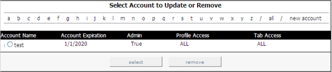

# Adición de cuentas nuevas{#adding-new-accounts}

Pasos para agregar nuevas cuentas.

1. En la [!DNL Report Portal], haga clic en la **[!UICONTROL Admin]** ficha. Aparece la [!DNL Admin] página.

   

1. En la parte derecha de la página, haga clic en **[!UICONTROL new account]**. Aparece la [!DNL Create New Account] página.

   

1. Complete todos los campos de esta página como se indica en la siguiente tabla:

   | En este campo . . . | Especifique . . . |
   |---|---|
   | nombre de cuenta | Nombre de la cuenta que el usuario debe proporcionar al iniciar sesión en [!DNL Report Portal]. |
   | email | La dirección de correo electrónico del usuario o grupo. |
   | password | La contraseña que debe proporcionar el usuario al iniciar sesión en [!DNL Report Portal]. |
   | confirmar contraseña | La contraseña que debe proporcionar el usuario al iniciar sesión en [!DNL Report Portal]. |
   | acceso a perfiles | Los perfiles a los que se permite acceder este usuario (por ejemplo, ProductSales). Para permitir el acceso a varios perfiles, separe los nombres por comas. Si el usuario tiene permiso para acceder a todos los perfiles asociados con [!DNL Report Portal], escriba &quot;ALL&quot;. |
   | acceso a ficha | Las fichas a las que este usuario puede acceder (por ejemplo, [!DNL Admin]). Para permitir el acceso a varias fichas, separe los nombres por comas. Si el usuario puede acceder a todas las fichas del [!DNL Report Portal], escriba &quot;ALL&quot;. Este campo, junto con el campo de tipo de cuenta, es muy útil para definir derechos de acceso de grupo. |
   | tipo de cuenta | Indica si esta cuenta es para un individuo o un grupo. Las cuentas individuales permiten a los usuarios restablecer sus contraseñas, mientras que los grupos no. Un administrador es la única persona capaz de restablecer la contraseña de una cuenta de grupo. |
   | status | Indica si esta cuenta está activa o inactiva. El valor predeterminado está activo. Para desactivar una cuenta de usuario, seleccione Inactiva. |
   | admin | Si se debe permitir que este usuario cree, actualice y elimine cuentas de usuario, así como editar las notas asociadas con cada informe. La configuración predeterminada es false. Para convertir este usuario en administrador, seleccione true. |
   | fecha de caducidad | La fecha, en formato MM/DD/AAAA, hasta la cual se permite el uso de este usuario [!DNL Report Portal]. |

1. Haga clic en **[!UICONTROL insert]**.
