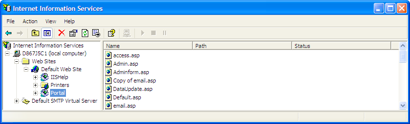

# Asignación del portal de informes a un directorio virtual (IIS 5.0){#mapping-report-portal-to-a-virtual-directory-iis}

Pasos para asignar el portal de informes a un directorio virtual (IIS 5.0).

1. En el equipo en el que está instalado [!DNL Report Portal], inicie el Administrador de IIS utilizando **[!UICONTROL Start]** > **[!UICONTROL Control Panel]** > **[!UICONTROL Administrative Tools]** > **[!UICONTROL Internet Information Services]** o **[!UICONTROL Start]** > **[!UICONTROL Administrative Tools]** > **[!UICONTROL Internet Information Services]**.

1. Seleccione **[!UICONTROL Local Machine]** > **[!UICONTROL Web Sites]** > **[!UICONTROL Default Web Site]**.

1. Haga clic con el botón derecho en **[!UICONTROL Default Web Site]** y seleccione **[!UICONTROL New]** > **[!UICONTROL Virtual Directory]**.

1. Cuando se abra [!DNL Virtual Directory Wizard], haga clic en **[!UICONTROL Next]**.

1. Complete los siguientes pasos para definir el directorio virtual raíz para [!DNL Report Portal]:

   1. Cuando se le pida un alias, escriba el nombre del [!DNL Report Portal] y haga clic en **[!UICONTROL Next]**. Por ejemplo, si desea utilizar &quot;Portal&quot; como nombre de su [!DNL Report Portal], asigne el alias &quot;Portal&quot; al directorio virtual. Haga clic en **[!UICONTROL Next]** cuando termine.

   1. Cuando se le pida la ruta física, busque y seleccione el directorio *&lt;**[!UICONTROL PortalName]*** **[!UICONTROL \PortalASP]** y haga clic en **[!UICONTROL Next]**.

      Ejemplo: [!DNL C:\Inetpub\wwwroot\Portal\PortalASP]

   1. Cuando se le solicite permisos, compruebe que las siguientes opciones están habilitadas:

      * **[!UICONTROL Read]**
      * **[!UICONTROL Run scripts (such as ASP)]**
   1. Haga clic en **[!UICONTROL Next]**, luego en **[!UICONTROL Finish]**. El directorio virtual que ha creado aparece en el Sitio Web predeterminado como se muestra en el siguiente ejemplo.

   

1. Haga clic con el botón derecho en el directorio virtual que acaba de crear y seleccione **[!UICONTROL New]** > **[!UICONTROL Virtual Directory]**.

1. Utilice el asistente [!DNL Virtual Directory] para crear un alias para cada uno de los siguientes directorios físicos. Al hacerlo, se crea un directorio virtual con el nombre adecuado para cada uno de estos recursos físicos.

<table id="table_B2E04423C20F40CAA8EDA3FCBA210AA2"> 
 <thead> 
  <tr> 
   <th colname="col1" class="entry"> Cree este alias . . . </th> 
   <th colname="col2" class="entry"> Para este recurso físico . . . </th> 
  </tr>
 </thead>
 <tbody> 
  <tr> 
   <td colname="col1"> Core </td> 
   <td colname="col2"> 
\<i>Nombre del portal</i>\PortalFiles\Core 
 
Ejemplo:  C:\Inetpub\wwwroot\Portal\PortalFiles\Core 
 </td> 
  </tr> 
  <tr> 
   <td colname="col1"> CSS </td> 
   <td colname="col2"> 
\<i>Nombre del portal</i>\PortalFiles\CSS 
 
Ejemplo:  C:\Inetpub\wwwroot\Portal\PortalFiles\CSS 
 </td> 
  </tr> 
  <tr> 
   <td colname="col1"> HTC </td> 
   <td colname="col2"> 
\<i>Nombre del portal</i>\PortalFiles\HTC 
 
Ejemplo:  C:\Inetpub\wwwroot\Portal\PortalFiles\HTC 
 </td> 
  </tr> 
  <tr> 
   <td colname="col1"> Imágenes </td> 
   <td colname="col2"> 
\<i>Nombre del portal</i>\PortalFiles\Images 
 
Ejemplo:  C:\Inetpub\wwwroot\Portal\PortalFiles\Images 
 </td> 
  </tr> 
  <tr> 
   <td colname="col1"> Salida </td> 
   <td colname="col2"> 
Ubicación física del directorio en el que  Report Server guarda el resultado de los conjuntos de informes. La carpeta de salida se puede ubicar en cualquier lugar, se le puede dar un nombre y contiene una subcarpeta para cada conjunto de informes. 
 
Debe ser el mismo directorio que especifique en el parámetro Raíz de salida en el archivo  Report.cfg para un conjunto de informes. Para obtener más información, consulte <a href="../../../../home/c-rpt-oview/c-admin-rpt/c-config-rpt-files.md#concept-cf4b95344fcb4c8c877db91e5f1d345d"> Configuración de los archivos de Report.cfg</a>. 
 
La ubicación predeterminada es \<i>PortalName</i>\PortalFiles\Output. 
 
Ejemplo:  C:\Inetpub\wwwroot\Portal\PortalFiles\Output 
 
El archivo <i>PortalName</i>\PortalFiles\Output directory contains the  profiles.xml, que debe moverse al directorio de salida que especifique para este alias. 
 
Es fundamental que el atributo  Path esté configurado correctamente. 
 </td> 
  </tr> 
 </tbody> 
</table>

1. Cuando haya terminado, compruebe que IIS muestre seis directorios virtuales nuevos. Asegúrese de que la estructura del directorio tiene una carpeta principal (con el mismo nombre que el portal) y cinco subcarpetas, como se muestra a continuación.

   

1. Cuando termine, vaya a [Editar el archivo de configuración de sesión](../../../../home/c-rpt-oview/c-install-rpt-port/t-edit-sess-config-file.md#task-cf11c3a780bd4936afd3f64a6b30afc7) para continuar con el proceso de instalación.
