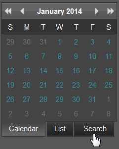

# Búsqueda avanzada en el portal de informes{#advanced-search-in-the-report-portal}

{{eol}}

El portal de informes proporciona una función de búsqueda para encontrar informes basados en una vista de árbol de carpetas, una vista de árbol de las fechas del informe y una búsqueda ad hoc.

1. Haga clic en el **[!UICONTROL Search]** en el panel izquierdo del portal de informes.

   

   Se abrirá una nueva página web que mostrará la variable **[!UICONTROL Search]** con la variable **[!UICONTROL Folder Tree]** como vista predeterminada.

   

1. Seleccione otras opciones de vista de los botones que aparecen en la parte superior de la página.

<table id="table_02610040A3284C07B62A6E70C0421573"> 
 <thead> 
  <tr> 
   <th colname="col1" class="entry"> Botón Buscar </th> 
   <th colname="col2" class="entry"> Descripción </th> 
  </tr> 
 </thead>
 <tbody> 
  <tr> 
   <td colname="col1"> 
Árbol de carpetas 
 </td> 
   <td colname="col2"> 
Seleccionar informes en función de la jerarquía personalizada de carpetas de informes. Estas carpetas se definen y organizan como un <a href="../../home/c-rpt-oview/c-work-rpt-sets/c-work-rpt-sets.md#concept-a5f078668e1245e684cb2a778c8803d5"> conjunto de informes</a>. 
 </td> 
  </tr> 
  <tr> 
   <td colname="col1"> 
Árbol de fechas 
 </td> 
   <td colname="col2"> 
Seleccionar carpetas basadas en una jerarquía de fechas definida por el servidor de informes. Los informes se organizan en función de la fecha (año/mes/día) en que se ejecutaron. 
 </td> 
  </tr> 
  <tr> 
   <td colname="col1"> 
Buscar 
 </td> 
   <td colname="col2"> 
Realizar búsquedas ad hoc en todos los informes. Si conoce el nombre completo del informe, puede introducirlo directamente en el cuadro de búsqueda. 
 
Además: 
 
    <ul id="ul_EAE30AAA865942078D0C6C0AE527C07C"> 
     <li id="li_F5213977442F4B89A62CA6BC315F95BE">Tipo a &lt;space&gt; para ver una lista desplegable de los nombres o caracteres iniciales de todos los informes existentes. </li> 
     <li id="li_C28799438777471290B424CAFFCAF810">Introduzca el nombre del informe y escriba un &lt;space&gt; para ver una lista desplegable que le permite rellenar automáticamente el nombre de un informe existente. </li> 
    </ul> </td> 
  </tr> 
  <tr> 
   <td colname="col1"> 
Anular todas las selecciones 
 </td> 
   <td colname="col2"> Haga clic en para borrar todos los informes seleccionados. </td> 
  </tr> 
  <tr> 
   <td colname="col1"> 
Mostrar seleccionado 
 </td> 
   <td colname="col2">Haga clic en para mostrar los informes seleccionados en el árbol de carpetas o en las vistas del árbol de fechas. El portal de informes se abrirá en una nueva ventana y mostrará cada informe como archivo .png. Si se seleccionan varios informes, cada informe individual se puede seleccionar desde una pestaña en la parte superior de la página. 
Haga clic en el  Imprimir en esta página para imprimir el informe seleccionado o hacer clic en  Descargar para almacenar localmente. 
 </td> 
  </tr> 
 </tbody> 
</table>
