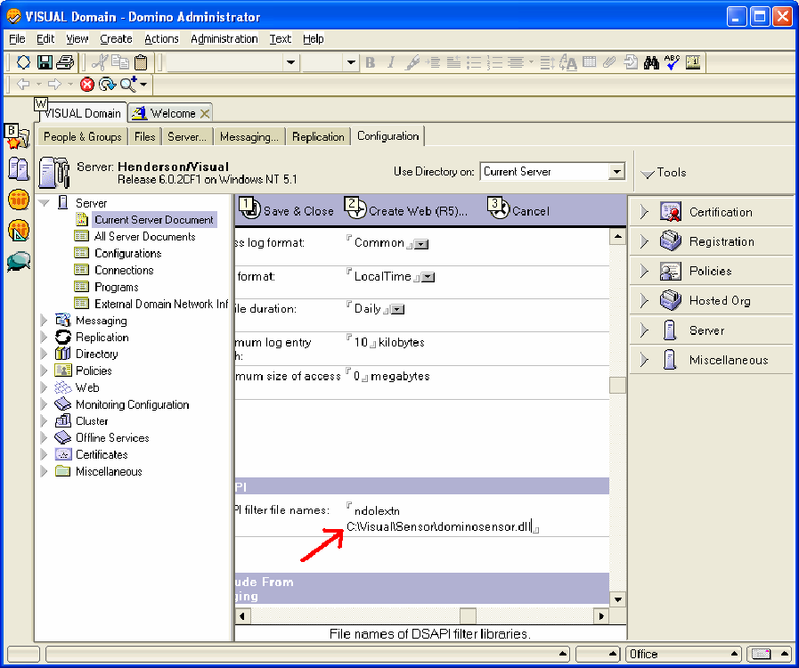

# Lotus Domino Server en Windows Server 2000 o posterior{#lotus-domino-server-on-windows-server-or-later}

Instrucciones sobre cómo instalar y configurar Sensor para Lotus Domino Server 6 para Windows 3.1 o posterior con Microsoft Windows Server 2000 o posterior.

Los archivos de programa para Sensor se empaquetan en un archivo de instalación que se obtiene del sitio de descarga de Adobe. Si aún no dispone del archivo de instalación de Sensor para su servidor web en particular, descárguelo (o consiga el archivo a su representante de Adobe) antes de comenzar los siguientes procedimientos.

Para instalar y configurar Sensor, debe realizar los siguientes pasos:

## Instalación de los archivos de programa {#section-2f3e85083b4f4aa989a85997330e86ae}

1. En el equipo Lotus Domino, cree un directorio para instalar los archivos del programa Sensor. Tenga en cuenta que la cola de discos también reside en este directorio, por lo que asegúrese de que el dispositivo que elija tenga espacio suficiente para mantener una cola del tamaño que necesita.

   ```
   C:\VisualSensor
   ```

1. Extraiga el contenido del archivo de instalación en el directorio Lotus Domino. Durante este paso, Sensor instala los siguientes archivos:

<table id="table_ABFF5F92271B4F3CB0AC68DAB6A5709F"> 
 <thead> 
  <tr> 
   <th colname="col1" class="entry"> Archivo </th> 
   <th colname="col2" class="entry"> Descripción </th> 
  </tr> 
 </thead>
 <tbody> 
  <tr> 
   <td colname="col1"> EventMessages.dll </td> 
   <td colname="col2"> Mensajes del visor de eventos </td> 
  </tr> 
  <tr> 
   <td colname="col1"> stchatlog.dll </td> 
   <td colname="col2"> El módulo del selector </td> 
  </tr> 
  <tr> 
   <td colname="col1"> <p>TestExperiment.xls </p> </td> 
   <td colname="col2"> <p>Archivo de hoja de cálculo de Excel que los arquitectos pueden utilizar para configurar un experimento controlado </p> <p>El sensor no utiliza este archivo. </p> </td> 
  </tr> 
  <tr> 
   <td colname="col1"> trust_ca_cert.pem </td> 
   <td colname="col2"> Certificado utilizado para validar el certificado digital que Insight Server presenta durante el proceso de conexión </td> 
  </tr> 
  <tr> 
   <td colname="col1"> TXLog.exe </td> 
   <td colname="col2"> El programa de transmisores </td> 
  </tr> 
  <tr> 
   <td colname="col1"> <p>txlogd.conf </p> </td> 
   <td colname="col2"> El archivo de configuración del sensor </td> 
  </tr> 
 </tbody> 
</table>

>[!NOTE]
>
>El paquete de instalación contiene un archivo de hoja de cálculo llamado TestExperiment.xls. Esta hoja de cálculo es una herramienta que los arquitectos utilizan para configurar un experimento controlado. El sensor mismo no utiliza este archivo, por lo que no es necesario instalar el archivo en el equipo en el que se está ejecutando Sensor (aunque puede elegir hacerlo). En su lugar, puede que desee copiar el archivo en una ubicación en la que los arquitectos puedan acceder a él o simplemente extraer el archivo del paquete de instalación según sea necesario. Para obtener más información sobre la experimentación controlada, consulte la Guía de experimentos controlados con perspectiva.

## Configuración de Lotus Domino Server {#section-2e2f1875a5304cdfa2cbcd0680683cfd}

Pasos para configurar Lotus Domino Server.

1. Inicie sesión en el administrador de Lotus Domino y haga clic en **[!UICONTROL Domain]**.

   

1. En el Administrador de Lotus Domino, haga clic en **[!UICONTROL Configuration]**.

   

1. Expanda el nodo Servidor y haga clic en **[!UICONTROL Current Server Document]**.

   

1. Click **[!UICONTROL Current Server Document]**, then click **[!UICONTROL Internet Protocols]**.

   

1. En la ficha HTTP, en la sección DSAPI, haga doble clic después de la palabra [!DNL ndolextn].

   

1. Pulse **[!UICONTROL Enter]** y escriba la ruta del [!DNL dominosensor.dll] archivo.

   

1. Haga clic en **[!UICONTROL Save & Close]**.

   

## Editar el archivo de configuración del sensor {#section-de0eb4a646394b61abb6cd5a2b706de0}

El archivo txlogd.conf contiene los parámetros de configuración para Sensor.

Debe editar este archivo para especificar, entre otras cosas, el tamaño y la ubicación del archivo de cola de disco, la dirección del servidor de Insight y el ID que se adjuntará a los datos de evento producidos por este sensor.

El archivo de configuración contiene parámetros opcionales y parámetros requeridos.

* **Los parámetros** requeridos son configuraciones que debe especificar al instalar Sensor. Sin esta configuración, Sensor no se ejecuta correctamente.
* **Los parámetros** opcionales son valores predeterminados para valores predefinidos (que puede modificar) o para activar funciones opcionales.

**Para editar el archivo de configuración del sensor**

* Abra el `<Sensor directory>/txlogd.conf` archivo en un editor de texto y defina los parámetros requeridos, así como los parámetros opcionales que desee.
* Guarde y cierre el archivo.

## Iniciar el transmisor y crear la cola de disco {#section-55630de65f264274aefd771da2002852}

Después de configurar el archivo txlogd.conf, puede iniciar el programa del transmisor, registrarlo como un servicio de Windows y crear la cola de discos.

1. En el menú Inicio de Windows, seleccione **Accesorios** > **Símbolo del sistema**.

1. En la ventana del símbolo del sistema, navegue al directorio en el que instaló Sensor y ejecute el siguiente comando:

   ```
   txlog /regserver
   ```

   Este comando inicia el transmisor, crea la cola de discos y registra Sensor como un servicio de Windows.

1. Para confirmar que el transmisor se está ejecutando correctamente, haga clic en **Inicio > Panel de control > Herramientas administrativas > Servicios**.

   >[!NOTE]
   >
   >Esta secuencia de comandos puede variar en función de la versión de Windows que utilice.

   1. En la lista de servicios, busque la entrada para Sensor y confirme que su estado es Iniciado y que su tipo de inicio es Automático.
   1. Cierre el panel de control Servicios.

1. Para comprobar si el transmisor ha experimentado algún error durante el inicio, haga clic en Inicio > Panel de control > Herramientas administrativas > Visor de eventos para abrir el Visor de eventos.

   >[!NOTE]
   >
   >Esta secuencia de comandos puede variar en función de la versión de Windows que utilice.

   1. En el panel izquierdo de la ventana Visor de eventos, seleccione el registro de aplicaciones.
   1. En el panel derecho, busque eventos con &quot;Adobe&quot; en la columna Origen.
   1. Si encuentra un error de &quot;Adobe&quot;, haga doble clic en el error para mostrar la ventana Propiedades del evento. Esta ventana proporciona información detallada sobre el error.

1. Cuando termine de examinar el registro de aplicaciones, cierre el visor de eventos.
1. Compruebe que el transmisor ha creado la cola de discos ( [!DNL Diskq2000.log]) en el directorio en el que instaló los archivos del programa Sensor y que es el tamaño especificado en el [!DNL QueueSize] parámetro en el [!DNL txlogd.conf] archivo.

   Si la cola no se ha creado correctamente:

   1. Examine el archivo txtlogd.conf y verifique que el parámetro QueueSize esté configurado correctamente.
   1. Compruebe que el dispositivo en el que instaló Sensor tiene suficiente espacio disponible para guardar un archivo del tamaño especificado en el parámetro QueueSize.
   1. Con el panel de control Servicios en Windows, detenga el transmisor.
   1. Elimine el archivo de cola.
   1. Volver a registrar Sensor como un servicio de Windows: en el menú Inicio de Windows, seleccione Accesorios > Símbolo del sistema. En la ventana del símbolo del sistema, navegue al directorio en el que instaló Sensor y ejecute el siguiente comando:

      ```
      txlog /regserver
      ```

      El transmisor está diseñado para funcionar continuamente. Si reinicia la máquina, el transmisor se reinicia automáticamente. Si necesita iniciar y detener el transmisor manualmente, puede hacerlo mediante el panel de control Servicios de Windows.

