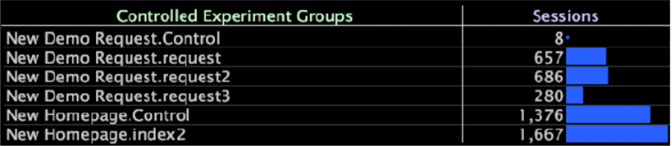

# Visualización de los resultados del experimento{#viewing-the-experiment-results}

Después de agregar el nuevo campo a Log Processing.cfg y crear la nueva transformación Dividir y la dimensión ampliada, puede ver la nueva dimensión ampliada que ha creado en cuanto la etapa de entrada rápida del reprocesamiento de datos haya finalizado.

De forma predeterminada, esta dimensión muestra el número de sesiones para cada uno de los grupos de experimentos.

**Para ver la dimensión del experimento**

* En cualquier espacio de trabajo de [!DNL Insight], abra una tabla con la dimensión de experimento que ha creado.

   Los elementos de dimensión del experimento, que representan cada experimento que está ejecutando y cada grupo dentro de cada experimento, se muestran con el número actual de sesiones para cada grupo. Cada grupo recibe el siguiente formato con el nombre del experimento seguido del nombre del grupo:

   *Nombre del experimento.Nombre del grupo*

   Por ejemplo: [!DNL New Homepage.Control]

La siguiente tabla muestra la dimensión Grupos de experimentos controlados que se creó en [!DNL Transformation.cfg] y cada uno de los experimentos y sus grupos.

El experimento Nueva página principal se muestra en la parte inferior de la tabla con sus dos grupos: Control e índice2.

Ahora puede utilizar la dimensión del experimento y cualquier métrica relevante para explorar e interpretar los resultados del experimento, así como crear informes útiles que detallen dichos resultados.
