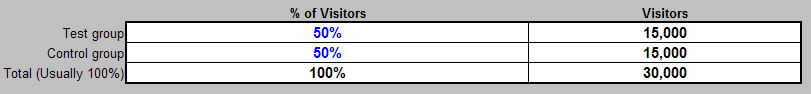

# Hoja de cálculo del diseño del experimento{#experiment-design-spreadsheet}

{{eol}}

Este archivo no solo funciona como una hoja de cálculo, sino también como un registro de las decisiones sobre el experimento.

Si necesita ayuda para diseñar el experimento, puede utilizar la hoja de cálculo de diseño del experimento (denominada VS Controlled Experiment Design.xls de forma predeterminada) proporcionada por Adobe.

La hoja de cálculo del diseño del experimento puede proporcionar inferencias estadísticas útiles solo cuando la métrica en cuestión se define como un porcentaje de visitantes que cumplen algunos criterios. Es decir, solo es útil al probar una hipótesis de métrica basada en visitantes.

**Para diseñar el experimento utilizando el archivo de diseño del experimento**

1. Si tiene acceso de administrador a sus servidores web o de aplicaciones, vaya a la [!DNL Sensor] carpeta de instalación en cualquier [!DNL Sensor] en el clúster web. Si no tiene acceso de administrador, póngase en contacto con el administrador de cuentas de Adobe para solicitar el archivo.
1. Abra el archivo VS Controlled Experiment Design.xls . (Si lo desea, puede cambiar el nombre de este archivo).

   La hoja de cálculo de la página siguiente es un ejemplo de cómo se completaría la hoja de cálculo al prepararse para probar la hipótesis de ejemplo utilizada en esta guía.

   

   

   

1. Introduzca texto o valores para todos los campos en azul en este archivo, que se describen en la siguiente tabla. Los campos calculados se definen en la segunda tabla.

<table id="table_C343F7A4BF3D4E0E9A5E9739EC7C2E10"> 
 <thead> 
  <tr> 
   <th colname="col1" class="entry"> En este campo... </th> 
   <th colname="col2" class="entry"> Especifique </th> 
  </tr> 
 </thead>
 <tbody> 
  <tr> 
   <td colname="col1"> Título del experimento </td> 
   <td colname="col2"> Un nombre descriptivo para el experimento. </td> 
  </tr> 
  <tr> 
   <td colname="col1"> Descripción del experimento </td> 
   <td colname="col2"> Descripción textual del experimento. </td> 
  </tr> 
  <tr> 
   <td colname="col1"> Métrica estudiada </td> 
   <td colname="col2"> 
Nombre de la métrica en la que se basa el experimento. 
 
Ejemplo: Conversión de visitante 
 </td> 
  </tr> 
  <tr> 
   <td colname="col1"> Definición de las métricas </td> 
   <td colname="col2"> 
Definición de la métrica en la que se basa el experimento. 
 
Formato: Visitantes[X]/Visitantes 
 
Ejemplo:  Visitors[URI='conversionpage.asp']/Visitors
 </td> 
  </tr> 
  <tr> 
   <td colname="col1"> Hora de inicio prevista </td> 
   <td colname="col2"> La fecha y la hora a las que desea que comience el experimento. </td> 
  </tr> 
  <tr> 
   <td colname="col1"> Hora de finalización prevista </td> 
   <td colname="col2"> La fecha y la hora a las que desea que finalice el experimento. </td> 
  </tr> 
  <tr> 
   <td colname="col1"> Selecciones aplicables </td> 
   <td colname="col2"> (Opcional) El nombre de la dimensión y el conjunto o intervalo de elementos por los que desea segmentar el conjunto de datos. </td> 
  </tr> 
  <tr> 
   <td colname="col1"> URI de experimento </td> 
   <td colname="col2"> Las URI implicadas en su hipótesis. Usted define los URI actuales para el grupo de control y los URI alternativos que ha creado o creará para los grupos de prueba. </td> 
  </tr> 
  <tr> 
   <td colname="col1"> Métricas esperadas para selecciones de aplicaciones </td> 
   <td colname="col2"> Encabezamiento de los valores de métrica que espera para el sitio web. </td> 
  </tr> 
  <tr> 
   <td colname="col1"> Promedio de visitantes por día </td> 
   <td colname="col2"> Número promedio de visitantes al sitio web por día. </td> 
  </tr> 
  <tr> 
   <td colname="col1"> Conversión de visitante </td> 
   <td colname="col2"> Tasa promedio de conversión de visitantes para el sitio web. </td> 
  </tr> 
  <tr> 
   <td colname="col1"> El experimento determinará si el nombre de la métrica para los grupos de prueba es ... </td> 
   <td colname="col2"> Encabezamiento para comparar los valores de las métricas. </td> 
  </tr> 
  <tr> 
   <td colname="col1"> ¿bueno que el valor del grupo de control? </td> 
   <td colname="col2"> Establezca este campo como True si desea poder concluir que la métrica del grupo de prueba aumentó durante el experimento. Establezca este campo como False para reducir el número de visitantes necesarios para sacar conclusiones. Adobe recomienda establecerlo en True. </td> 
  </tr> 
  <tr> 
   <td colname="col1"> ¿Menor que el valor del grupo de control? </td> 
   <td colname="col2"> Establezca este campo como True si desea poder concluir que la métrica del grupo de prueba disminuyó durante el experimento. Adobe recomienda establecerlo en True. </td> 
  </tr> 
  <tr> 
   <td colname="col1"> Al menos por (nivel de detección) </td> 
   <td colname="col2"> El porcentaje en el que desea que la métrica del grupo de prueba sea mayor o menor que la del grupo de control. </td> 
  </tr> 
  <tr> 
   <td colname="col1"> Con un nivel de confianza de al menos </td> 
   <td colname="col2"> Nivel de confianza deseado para los valores de grupo de prueba. El nivel de confianza determina el número de falsos positivos para medir la probabilidad de que la expectativa declarada sea verdadera. </td> 
  </tr> 
  <tr> 
   <td colname="col1"> y un nivel de potencia de </td> 
   <td colname="col2"> Nivel de potencia deseado para los valores de grupo de prueba. El nivel de potencia determina el número de falsos negativos. </td> 
  </tr> 
  <tr> 
   <td colname="col1"> % de visitantes </td> 
   <td colname="col2"> Encabezamiento para los valores de porcentaje de visitantes. </td> 
  </tr> 
  <tr> 
   <td colname="col1"> Grupo de prueba </td> 
   <td colname="col2"> Porcentaje de visitantes que desea incluir en el grupo de prueba. Puede jugar con este número hasta que el valor del campo Total (Generalmente 100%) de la sección Visitantes sea igual o bueno que el valor del campo Visitantes mínimos requeridos (Grupos de control+prueba), que se describe en la siguiente tabla. </td> 
  </tr> 
  <tr> 
   <td colname="col1"> Grupo de control </td> 
   <td colname="col2"> Porcentaje de visitantes que desea incluir en el grupo de control. </td> 
  </tr> 
  <tr> 
   <td colname="col1"> Otras notas de diseño </td> 
   <td colname="col2"> Cualquier nota que desee guardar para referencia futura. </td> 
  </tr> 
 </tbody> 
</table>

Los campos restantes se calculan según los valores introducidos y se describen en la tabla siguiente.

| Campo | Descripción |
|---|---|
| Métricas esperadas para selecciones de aplicaciones | Encabezamiento de los valores de métrica que espera para el sitio web. |
| Visitantes esperados por período | Normalmente, este campo se calcula automáticamente mediante la hoja de cálculo. Se basa en el supuesto de que, en la mayoría de los días, el sitio web recibe muchos más visitantes nuevos que los que regresan. Si no es así, el cálculo de esta celda debe sobrescribirse con el número real de visitantes esperados durante el experimento. |
| Puntuación Z calculada para error de tipo I | La puntuación Z para un resultado falso positivo. Se trata de un cálculo estadístico intermedio. |
| Puntuación Z calculada para error de tipo II | La puntuación Z para un resultado falso negativo. Se trata de un cálculo estadístico intermedio. |
| Visitantes mínimos requeridos (grupos de control+prueba) | Número mínimo de visitantes necesarios en el experimento para alcanzar el nivel de confianza, el nivel de potencia y la puntuación Z especificados, expresados como porcentaje del valor en el campo Visitantes esperados por periodo . |
| Visitantes mínimos requeridos (grupos de control+prueba) | Número mínimo de visitantes necesarios en el experimento para alcanzar el nivel de confianza, el nivel de potencia y la puntuación Z especificados. Este valor debe ser menor o igual que el valor del campo Total (Generalmente 100%) en la sección Visitantes . |
| Tiempo mínimo del experimento (días) | Número mínimo de días que debe ejecutar el experimento para alcanzar el nivel de confianza, el nivel de potencia y la puntuación Z especificados. Este número calculado está sujeto a los mismos problemas que se discuten en el campo Visitantes esperados por periodo . En el caso de un sitio web con muchos visitantes que regresan, el campo Tiempo mínimo del experimento (días) es la cantidad esperada de días que se tarda en ver un número de visitantes únicos igual al valor del campo Visitantes mínimos requeridos . |
| Visitantes | Encabezamiento para los valores de visitantes. |
| Grupo de prueba | Número de visitantes necesarios en el grupo de prueba. |
| Grupo de control | Número de visitantes necesarios en el grupo de control. |
| Total (Generalmente 100%) | Número total de visitantes necesarios para el experimento. Este valor debe ser igual o bueno que el valor del campo Mínimo de visitantes necesarios (grupos de control+prueba). |
| Precisión del grupo de prueba (en el nivel de confianza de Target) | Porcentaje que indica que hay una probabilidad igual al nivel de confianza especificado de que el valor medido de la métrica calculada para el grupo de prueba estará dentro de este porcentaje de su valor verdadero. |
| Precisión del grupo de control (en el nivel de confianza de Target) | Porcentaje que indica que existe una probabilidad igual al nivel de confianza especificado de que el valor medido de la métrica calculada para el grupo de control se encuentre dentro de este porcentaje de su valor verdadero. |
| Puntuación Z (con precisión de Target) | Número de desviaciones estándar que un valor determinado es respecto a la media de la prueba. |
| Nivel de confianza real (en el intervalo de destino) | Nivel de confianza alcanzado para el experimento. El nivel de confianza mide la probabilidad de que la expectativa declarada sea verdadera. |
| Intervalo real (en el nivel de confianza de Target) | El intervalo de confianza alcanzado para el experimento, que proporciona un intervalo estimado de valores que probablemente incluyan un parámetro de población desconocido. Este intervalo se calcula a partir de un conjunto determinado de datos de ejemplo. |

Debe ver el valor en el campo Mínimo de visitantes necesarios (grupos de control+prueba) . . .

y compárela con el valor del campo Total de la variable [!DNL Visitors] para abrir el Navegador.

Para que el experimento sea estadísticamente válido, el valor del campo Total (Generalmente 100%) debe ser igual o bueno que el valor del campo Visitantes mínimos requeridos (Grupos de control+prueba).

Dadas las entradas proporcionadas, lo que la hoja de cálculo de ejemplo muestra es que 10 475 visitantes deben participar en este experimento para lograr la tasa de confianza del 95 % introducida (que es la confianza mínima sugerida para cualquier experimento controlado, aunque puede aumentar este número). El experimento, tal como está diseñado actualmente, incluye a 30.000 visitantes, lo que supera con creces el número mínimo de visitantes necesario.

Si mantiene el número de días igual, puede aumentar el nivel de confianza siempre que el número total de visitantes continúe con la reunión o supere el mínimo requerido.

1. Guarde el archivo para los registros y, a continuación, utilice la información del archivo para configurar el experimento con la hoja de cálculo de configuración del experimento. Para obtener más información sobre esta hoja de cálculo, consulte [Configuración e implementación del experimento](../../home/c-undst-ctrld-exp/t-crt-ctrld-exp/c-cnfg-dply-exp.md#concept-50f1de0242904698937bb72b3ea1b429).
