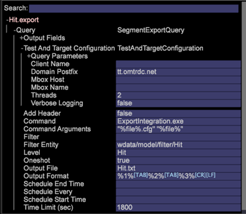

# Integración del área de trabajo de datos con Adobe Target

La integración de Área de trabajo de datos de Adobe con Adobe Target se hizo más sencilla con las funciones de Área de trabajo de datos para exportar segmentos de datos y rellenar automáticamente los archivos de exportación.

El Área de trabajo de datos de Adobe proporciona integración de bucle cerrado con Adobe Target para compartir datos y generar informes. Dentro del área de trabajo de datos puede analizar poblaciones para segmentos significativos mediante el uso de todos los datos disponibles, incluidas las conversiones sin conexión a través de canales como teléfono, una tienda, etc.

Por ejemplo, un visitante busca zapatos en su sitio web pero no convierte. En su lugar, el visitante descarga un cupón por un 20 por ciento de descuento en su próxima compra y luego compra una camisa en su tienda. Con el Área de trabajo de datos, puede recopilar esos datos y luego trasladar los datos de perfil a Target para mostrar que el visitante compró una camisa sin conexión. A continuación, puede dirigir una campaña que ofrezca una corbata a ese visitante, cuando Target normalmente intente volver a vender zapatos a ese visitante.

## Configuración de Área de trabajo de datos con Adobe Target

1. Haga clic con el botón secundario en el encabezado de la [!UICONTROL Detail Table] ventana.

   

1. Seleccione **[!UICONTROL New Target Export]** e introduzca el nombre de un nuevo archivo de exportación en el comando del **[!UICONTROL Save As]** menú.

1. Haga clic en **[!UICONTROL Save Export File]**.

   Se abrirá una ventana de plantilla de exportación.

   Toda la información de Adobe Target se rellena automáticamente. Genera la lista de parámetros en función de lo que se ponga en la exportación de segmentos. Cuando se complete, Área de trabajo de datos enviará los datos al servidor de Adobe Target.

   **Nota:** El archivo de plantilla debe configurarlo el [!UICONTROL Profile Architect]. Se debe introducir el [!UICONTROL Client Name], [!UICONTROL Domain Postfix], [!UICONTROL Mbox Host]y [!UICONTROL Mbox Name] . Si tiene varios sitios, rellene varias plantillas y guárdelas en el servidor. Las plantillas del Administrador de perfiles se encuentran en `Context\FileNew\Detail Table\Export\Copy`.

   

1. Especifique el parámetro de [!UICONTROL mboxPC] consulta.

   Si el nombre del atributo del Área de trabajo de datos no es [!UICONTROL mboxPC], debe editar el parámetro de consulta adecuado y cambiarle el nombre por _mboxPC_.

   

   Al guardar el archivo de exportación en el servidor, se iniciará la exportación. Una vez completada, la aplicación se iniciará y comenzará a enviar datos a la cuenta de Target. [!UICONTROL TnTSend.exe]

## Configuración del área de trabajo de datos para Target

Complete las siguientes tareas en Adobe Target:

Área de trabajo de datos está pasando perfiles de usuario a Adobe Target. Para configurar la exportación a Target, debe configurar y habilitar su API y proporcionar los parámetros **[!UICONTROL clientname]** y **[!UICONTROL domain postfix]** para el archivo de configuración de exportación (`export.cfg`).

Se ha agregado una nueva opción booleana llamada **[!UICONTROL Oneshot]** a los archivos de exportación de segmentos. Esta opción se incluye en el archivo de plantilla distribuido con el nuevo perfil. Si [!UICONTROL Oneshot] se establece en _true_, se cambiará el nombre del `.export` archivo a `.export.done-TIMESTAMP` una vez completada la exportación, lo que garantiza que el segmento nunca se exportará más de una vez. Esto es importante al exportar a Adobe Target.

**Nota:** Una llamada de Área de trabajo de datos a Adobe Target se cuenta como una [!UICONTROL mbox] llamada, lo que requiere una llamada por cada perfil enviado. En consecuencia, los costos aumentan si se requieren varias llamadas entre las dos soluciones.

Una configuración incompleta genera el siguiente mensaje de error en el registro:

```
TNT-040615-133212-Adobe-Target-Product-Test.log:
TnT Configuration left out these empty fields:
ClientName,MboxHost,MboxName
```

## Configuración de Adobe Target para Área de trabajo de datos

En Adobe Target no se necesita una configuración especial para que un cliente envíe datos de perfil. La información de perfil de un usuario se suele pasar en la [!UICONTROL mbox] solicitud regular y los servidores harán que los parámetros de perfil estén disponibles para una configuración de campaña de objetivo como funcionalidad estándar sin ninguna configuración adicional.

Adobe Target tiene integrada la integración de Área de trabajo de datos, que se puede activar desde la página Detalles del cliente de superusuario. Al habilitar la opción, aparecerán segmentos compartidos desde el área de trabajo de datos en Adobe Target para que estén disponibles para objetivos.

## Establecer informes de registro HTTP en ExportIntegration.exe

Reduzca los informes largos a [!UICONTROL HTTP.log] la hora de [!UICONTROL ExportIntegration.exe] exportar archivos de integración de Adobe Target.

Un nuevo archivo [!UICONTROL httpLoggingEI.cfg] de configuración (ubicado en `server\Admin\Export\httpLoggingEI.cfg`) permite reducir el registro detallado en el [!UICONTROL HTTP.log] archivo para cuando se exportan datos mediante [!UICONTROL ExportIntegration.exe]. Esto le permite detener el registro detallado de solicitudes y respuestas.

El registro detallado ya se captura en [!UICONTROL TnTSend.log] los archivos.

_True_ establece el registro detallado y _False_ detiene el registro detallado en el [!UICONTROL HTTP.log] archivo.

En la opción Falso, solo se enviará un mensaje de advertencia al [!UICONTROL HTTP.log] archivo (no se enviará el contenido de información).