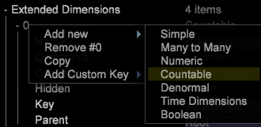

# Estructuras contables de diseño del esquema{#schema-design-countable-structures}

Explicación de los recuentos en Data Workbench (DWB) para diseñar e implementar el esquema.

## Comprensión del recuento en la Data Workbench {#section-6e6b8d1c17634d669e62c91a80a0bc62}

En el nivel más alto hay dimensiones contables. Las dimensiones contables cumplen dos funciones principales. En primer lugar, son dimensiones cuyos elementos desea contar. En otras palabras, los recuentos responden a preguntas como:

* ¿Cuántos visitantes visitaron su página principal?

* ¿Cuántas visitas vinieron de Google.com?

`<discoiqbr>`Las dimensiones contables generalmente se utilizan para crear métricas de suma, que devuelven el recuento, o la suma, de todos los elementos de la dimensión. Puede definir dimensiones contables para contar instancias como reservaciones o pedidos de productos. Por ejemplo, puede definir los pedidos de dimensión contables cuyos elementos (entradas de registro correspondientes a pedidos de la tienda en línea) se puedan contar. Si desea mostrar un recuento de pedidos dentro de una visualización, debe definir la métrica de la suma de pedidos, que puede evaluarse sobre una dimensión o aplicarle filtros.

Las dimensiones contables pueden ser principales con respecto a otras dimensiones o secundarias con respecto a otras dimensiones contables.

Aunque la dimensión contable raíz no tiene que estar asociada con los ID de seguimiento en los datos, Adobe recomienda configurar la dimensión contable raíz del conjunto de datos para que utilice el campo de ID de seguimiento (x-trackingid) como Clave. Como resultado, cada elemento de la tabla raíz está asociado con un valor único de x-trackingid, y todos los datos de cada elemento se agrupan.

Las dimensiones contables se definen con los siguientes parámetros:

<table id="table_5E00B72CFDD645368ADCC25AB9B5E53D"> 
 <thead> 
  <tr> 
   <th colname="col1" class="entry"> Parámetro </th> 
   <th colname="col2" class="entry"> Descripción </th> 
   <th colname="col3" class="entry"> Predeterminado </th> 
  </tr>
 </thead>
 <tbody> 
  <tr> 
   <td colname="col1"> Nombre </td> 
   <td colname="col2"> Nombre descriptivo de la dimensión tal como aparece al usuario en Data Workbench. El nombre de la dimensión no puede incluir un guión (-). </td> 
   <td colname="col3"> </td> 
  </tr> 
  <tr> 
   <td colname="col1"> 
Comentarios 
 </td> 
   <td colname="col2"> 
Opcional. Notas sobre la dimensión extendida.

    &lt;/p> &lt;/td>
<td colname="col3"> </td> 
  </tr> 
  <tr> 
   <td colname="col1"> 
Condición 
 </td> 
   <td colname="col2"> 
Condiciones en las que el campo de entrada contribuye a la creación de la dimensión contable. Si se especifica, una condición restringe el conjunto de entradas de registro visibles para la dimensión y todos sus elementos secundarios en el esquema del conjunto de datos. 
 </td> 
   <td colname="col3"> </td> 
  </tr> 
  <tr> 
   <td colname="col1"> Oculto </td> 
   <td colname="col2"> Determina si la dimensión aparece en la interfaz de Data Workbench. De forma predeterminada, este parámetro se establece en false. Si, por ejemplo, la dimensión se va a utilizar solo como base de una métrica, puede establecer este parámetro en true para ocultar la dimensión de la visualización del Data Workbench. </td> 
   <td colname="col3"> false </td> 
  </tr> 
  <tr> 
   <td colname="col1"> Clave </td> 
   <td colname="col2"> 
Opcional. Nombre del campo que se va a utilizar como clave. Si define este parámetro, existe un elemento de la dimensión contable para cada combinación de un elemento del elemento principal de la dimensión contable y un valor distinto del campo especificado como clave. 
 
Cada elemento de la dimensión contable es necesario para relacionarse con un conjunto contiguo de entradas de registro. Por lo tanto, si las entradas de registro no están ordenadas por la clave, se crea un elemento de la dimensión contable cada vez que cambia el campo clave. Para evitar esta situación, Adobe recomienda utilizar una clave única que sea contigua en el orden de tiempo. 
 </td> 
   <td colname="col3"> </td> 
  </tr> 
  <tr> 
   <td colname="col1"> Principal </td> 
   <td colname="col2"> 
 Nombre de la dimensión principal. Cualquier dimensión contable puede ser una dimensión principal. Para que una dimensión sea la dimensión de nivel superior en el esquema del conjunto de datos, establezca el parámetro en "raíz". La dimensión definida se convierte en la dimensión contable raíz para el conjunto de datos. Por ejemplo, si está trabajando con el Sitio, la dimensión Visitante es la dimensión contable raíz del conjunto de datos. 
 
Nota: Aunque la dimensión contable raíz no tiene que estar asociada con los ID de seguimiento en los datos, Adobe recomienda configurar la dimensión contable raíz del conjunto de datos para que utilice el campo de ID de seguimiento (x-trackingid) como su Clave. Como resultado, cada elemento de la tabla raíz está asociado con un valor único de x-trackingid, y todos los datos de cada elemento se agrupan. Si desea configurar el conjunto de datos de forma diferente, póngase en contacto con el Adobe. 
 </td> 
   <td colname="col3"> </td> 
  </tr> 
 </tbody> 
</table>

Este ejemplo ilustra la definición de una dimensión contable mediante los datos de evento recopilados a partir del tráfico del sitio web. La dimensión contable cuenta los eventos de campaña web dentro de una sesión determinada. Se supone que todos los recursos de campaña de correo electrónico se solicitan desde el servidor web con &quot;email=&quot; como parte de cs-uri-query. En el ejemplo, el número de veces que el visitante responde a una campaña de correo electrónico durante una sesión determinada es de interés, no el valor real del campo cs-uri-query(email) .

La segunda función principal de las tablas contables es que forman la columna vertebral de la estructura de esquema del conjunto de datos. El esquema de datos y todas las demás dimensiones se organizan para agruparse en y pertenecen a una cuenta. En otras palabras, si consideramos las dimensiones como &quot;categorías&quot;, entonces los recuentos son la forma en que organizamos estas &quot;categorías&quot; en grupos.
Cuando las dimensiones se agrupan en una dimensión contable, se dice que se encuentran en el &quot;nivel&quot; de la dimensión contable. Por ejemplo, en la figura siguiente puede ver que &quot;Dirección de correo electrónico&quot; está en el nivel del visitante y &quot;Explorador&quot; en el nivel de la visita. &quot;Principal&quot; y &quot;secundario&quot; se refieren a la relación entre la tabla contable y las dimensiones agrupadas debajo de ella. Por ejemplo, Visitante es un &quot;elemento principal&quot; de la dirección de correo electrónico. Por el contrario, la dirección de correo electrónico es un &quot;elemento secundario&quot; del visitante.  

## Creación de un recuento en la Data Workbench {#section-491f3e8e4fbc429e95d6c97f012a208e}

Realice los siguientes pasos para crear la tabla contable en Data Workbench:

1. Abrir administrador de perfiles
1. En Transformation folder, cree un archivo de configuración y ábralo en la estación de trabajo.
1. En Dimension extendidos, haga clic con el botón derecho y seleccione Agregar nuevo -> Contable como se muestra a continuación: 

1. Introduzca el nombre de la nueva tabla contable. En el ejemplo siguiente, se define Contable de clientes. Si es el Contable de nivel más alto, entonces en la Raíz de escritura principal. 

   Si Contable no es el nivel superior, en el campo principal asigne el nombre de Contable principal. En el ejemplo siguiente, se crea la tabla de contabilización de participación y el elemento principal de esta tabla contable es Cliente. 

Para obtener información adicional sobre la arquitectura de Data Workbench para el diseño de esquemas, estructuras contables y configuraciones de fuentes de datos sin conexión, consulte [Interfaz de esquema de conjuntos de datos](https://experienceleague.adobe.com/docs/data-workbench/using/client/admin-ui/c-dtst-sch-intrf.html).
