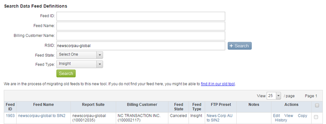

# Validación de fuentes de datos históricas{#validating-historical-data-feeds}

Una guía rápida de los pasos mínimos necesarios para validar y configurar fuentes de datos históricas.

## Pasos de validación para la coherencia de las fuentes de datos {#section-777b2c627a354627a02feb9461e23038}

1. Inicio de sesión en los *programas de desarrollo* (https://oasis.omniture.com/drteeth/)
1. Vaya a Administración de SiteCatalyst -> Definición de fuente de datos (nueva)
1. Ir a la ubicación del servidor (p. ej. Dallas, Londres...) Según la ubicación de su organización.
1. Proporcione RSID y seleccione el tipo de fuente Insight y haga clic en *buscar*.

   

1. Identifique el nombre real de la fuente para su cliente.
1. Haga clic en Historial en la sección Acciones. 

   Compruebe si hay errores en el campo de estado y, en caso de que alguna fuente esté en estado de error, seleccione la fuente y haga clic en reprocesar. Si se produjo un error en varias solicitudes, envíe un correo electrónico a *`dataworkbench@adobe.com`* con los detalles de ID de fuente y de grupo de informes para volver a procesarlo.

1. La postvalidación comprueba los registros en la carpeta sin procesar de la ubicación NAS.

