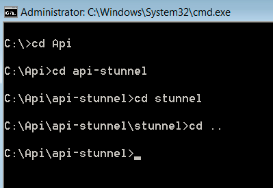

# Configuración de API de consulta{#query-api-setup}

Guía rápida para configurar una API de consulta.

Siga los pasos a continuación para configurar la API de consulta:

1. Adquisición de certificados de API de consulta

   Envíe un correo electrónico al equipo de operaciones técnicas de Adobe Email - `Dataworkbench@adobe.com`.

   Proporcione el nombre CN que desee utilizar para la API de consulta (proporcione un nombre genérico como `<Client>` Query API).

   >[!NOTE]
   >
   >Las operaciones técnicas generarán el certificado y lo cargarán en una dirección URL. Comuníquese con los consultores de Adobe después de recibir la notificación de Tech Ops sobre la generación exitosa del ticket, de modo que éstos le envíen de vuelta el ticket.

1. Descarga y extracción del embudo de API. Reciba el archivo api-stunnel de su consultor.

   Asegúrese de que Perl está instalado en su equipo.

   En la carpeta extraída (la ruta de la carpeta en la que se copia el archivo), copie el certificado de API de consulta dentro de la carpeta *stunnel* .

1. Configurar Stunnel.conf

   Debe haber un archivo llamado *stunnel.conf* dentro de la carpeta *Stunnel* (donde copió el certificado).

   Edite el archivo en el Bloc de notas.

   

   Cambie los parámetros de la siguiente manera: 

   Hay que cambiar dos parámetros en este archivo.

   * *Cert* = El nombre del certificado. En este ejemplo es Aadhithiya Ramani QAPI Client.pem.
   * *Connect* =El nombre del servidor para la DPU principal.

1. Copia de *Query.pm*.

   El archivo *Query.pm* estará disponible en la carpeta de la API de Insight.

   Copie el archivo *Query.pm* y péguelo en la carpeta de la biblioteca Perl (normalmente será *C:\Perl64\lib *, pero compruebe dónde está instalado Perl en el equipo).

1. Modificar el *archivo api-http.pl*

   El archivo api-http.pl estará disponible en la carpeta api-stunnel.

   Solo se modificará un parámetro

   *Mi $profile* = El nombre de perfil para el que está configurando la API de consulta.

1. Instale la API de consulta.

   Abra el símbolo del sistema como &quot;Administrador&quot; y vaya al directorio en el que extrajo el *stunnel* como se muestra: 

   Ejecute el siguiente comando *.\stunnel -install*. 

   Después de ejecutar el comando, se abrirá una ventana que indica que se ha instalado el *metralla* .

   >[!NOTE]
   >
   >Después de ejecutar el comando, se abrirá una ventana que indica que se ha instalado el *metralla* .

1. Prueba de la configuración de la secuencia de comandos de Query API

   El paso final de este proceso será probar la configuración de la API de consulta. En el símbolo del sistema que utilizó para instalar el directorio api-stunnel. 

   Ejecute la secuencia de comandos Perl disponible en esa carpeta con el siguiente comando* perl api-http.pl*. 

   Después de ejecutar la secuencia de comandos, los resultados deben ser como los de la captura de pantalla siguiente (la fecha, hora y valores del resultado variarán según el tiempo y otros parámetros del perfil en el que haya configurado la API de consulta (en el paso 6). 

