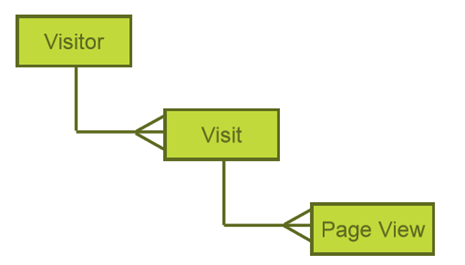
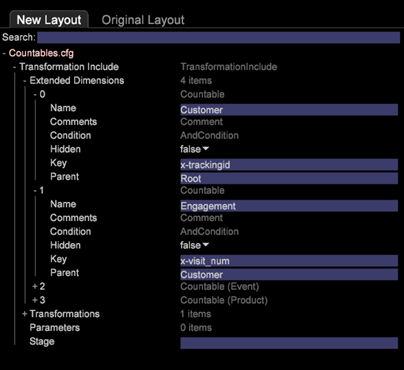
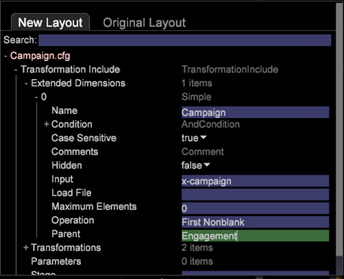

# Cambios en la configuración para nuevo esquema{#configuration-changes-for-new-schema}

{{eol}}

En este documento se explica cómo cambiar todas las configuraciones de Data Workbench predeterminadas una vez que se haya implementado el nuevo esquema.

## Explicación del esquema del conjunto de datos {#section-2ffac5170c894781bc943565af7ad479}

La base del esquema del conjunto de datos consiste en un conjunto clave de relaciones que forman la columna vertebral del esquema de análisis web de la Data Workbench. En el siguiente ejemplo, el esquema de análisis web típico proporciona una idea de las relaciones entre un visitante, una visita y una vista de página. 

* Cualquier visitante puede tener una o más visitas.
* Cualquier visita determinada la genera un solo visitante.
* Cualquier visita determinada puede incluir una o más vistas de página.
* Cualquier vista de página dada pertenece a una sola visita. `<discoiqbr>`

A medida que la web y el mundo empresarial han evolucionado con los años, las necesidades de análisis de datos y web también han cambiado. Los sitios web comenzaron como lugares para ver el contenido. Ahora, puede ver el contenido; corresponder de forma interactiva mediante chats, vídeos o envíos; comprar productos; y mucho más. Además, ahora las empresas desean integrar sus datos web con otros canales de datos de su negocio para obtener una mejor visión de su negocio en su conjunto. Por ejemplo, una empresa puede querer integrar sus datos web, centro de llamadas, correo electrónico, social y almacenar y clientes juntos. Con esta integración de canales en línea y sin conexión, los esquemas de conjuntos de datos han evolucionado con los años en los que no hay dos esquemas de conjuntos de datos iguales.

`<discoiqbr>`Cuando integra los datos en línea y sin conexión, el término &quot;visitante&quot; no siempre parece apropiado. Como resultado, a veces se utiliza el término &quot;cliente&quot; en lugar del visitante.  

El nivel &quot;Participación&quot; se utiliza para habilitar una sola vista del tiempo, cuando tiene datos de varias fuentes de datos. Por ejemplo, suponga que solo tiene una fuente de datos: datos de comercio electrónico recopilados por la actividad de los visitantes en el sitio web. En ese caso, el nivel de visita indica las visitas al sitio por parte de esos visitantes. Tenga en cuenta que las dimensiones de tiempo - &quot;Día&quot;, &quot;Semana&quot;, &quot;Mes&quot;, etc. - generalmente se capturan en el nivel de &quot;Visita&quot;.

Del mismo modo, el nivel &quot;Evento&quot; trae todos los eventos (vista de página, llamada al centro de llamadas, etc.) que se produjeron durante una participación. Combina todos los eventos en línea y sin conexión para un cliente durante una participación.

## Nueva estructura contable en DWB {#section-b77638ec04e4441cb51c56fd3d4abeb6}

La nueva estructura de esquema sustituye a Visitante por Cliente, Visita por Participación y Visita por Evento. 

## Cambios de configuración según el nuevo esquema de conjunto de datos {#section-27135515be5c471ba2ee879d1ef4771f}

Para cambiar el esquema del conjunto de datos de visitante a cliente, debe cambiar los siguientes archivos de configuración:

1. Todos los archivos de configuración de la carpeta Dataset donde se definen dimensiones contables y extendidas. 

1. Los archivos de configuración de la carpeta del Dimension se utilizan como Nivel para los archivos &quot;visitante&quot;, &quot;visita&quot; o &quot;evento&quot;.

   Ejemplo: Archivo Campaign.cfg. En el perfil de Adobe SC, Campaign se define en el nivel de visita. 

   El siguiente ejemplo proporciona una idea del cambio del esquema principal de Visita a Participación: 

1. Como algunas métricas se derivan o se crean a partir de tablas contables, los archivos de configuración de la carpeta Métricas deben modificarse o crearse.

   Por ejemplo: crear una nueva métrica [!DNL Customers.metric with formula = sum(one,customer)] o como Vistas de página.métrica a *definir* en el nivel de visita. Modifique la métrica y, a continuación, cambie el nivel a Evento en lugar de Visita individual.

   Métrica de vistas de página de Adobe SC definida en el nivel de visitas individuales: 

   `<discoiqbr>` `<discoiqbr>`A continuación se muestra la métrica Vistas de página según el nuevo esquema: 

1. Cambie el *order.txt* en la carpeta métricas para que refleje las métricas nuevas o modificadas relacionadas con el cliente, la participación y el evento.

   Adobe *SC order.txt* archivo. 

   *Order.txt* con nuevos cambios de esquema: 

1. Todos los archivos de configuración (.vw) de la carpeta Visualization deben cambiarse para hacer referencia a nuevos niveles : Cliente, participación y evento. Por ejemplo: Mapa de proceso 2D, Mapa de proceso 3D, etc.

   El URI predeterminado de Adobe SC.vw para el mapa de proceso 2D se define en el nivel de visita individual y en el grupo de visitas como se muestra a continuación: 

   Cambios que se realizarán en URI.vw para el nuevo esquema: 
