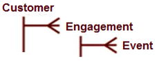

# Cambios de configuración para nuevo esquema{#configuration-changes-for-new-schema}

En este documento se explica cómo cambiar todas las configuraciones predeterminadas del Área de trabajo de datos una vez que el nuevo esquema esté establecido.

## Explicación del esquema del conjunto de datos {#section-2ffac5170c894781bc943565af7ad479}

La base del esquema del conjunto de datos consiste en un conjunto clave de relaciones que forman la columna vertebral del esquema de análisis web de Área de trabajo de datos. En el ejemplo siguiente, el esquema analítico web típico proporciona una idea de las relaciones entre un visitante, una visita y una vista de página. 

* Cualquier visitante determinado puede tener una o más visitas.
* Una sola visita genera cualquier visita.
* Cualquier visita determinada puede incluir una o más vistas de página.
* Cualquier vista de página dada pertenece a una sola visita. `<discoiqbr>`

A medida que la Web y el mundo empresarial han evolucionado con los años, las necesidades de análisis de datos y de la Web también han cambiado. Los sitios Web comenzaron como lugares para ver el contenido. Ahora, se puede ver el contenido; corresponder interactivamente a través de chats, videos o envíos; comprar productos; y mucho más. Además, ahora las empresas desean integrar sus datos web con otros canales de datos de su negocio para obtener una mejor visión de su negocio en su conjunto. Por ejemplo: es posible que una empresa desee integrar sus datos web, de centro de llamadas, de correo electrónico, sociales y de almacenamiento y de clientes. Con esta integración de canales en línea y sin conexión, los esquemas de conjuntos de datos han evolucionado con los años en los que no hay dos esquemas de conjuntos de datos iguales.

`<discoiqbr>`Cuando integra los datos en línea y sin conexión, el término &quot;visitante&quot; no siempre parece apropiado. Como resultado, a veces se utiliza el término &quot;cliente&quot; en lugar del visitante.  

El nivel &#39;Participación&#39; se utiliza para habilitar una sola vista del tiempo, cuando se tienen datos de varias fuentes de datos. Por ejemplo, supongamos que solo tiene una fuente de datos: datos de comercio electrónico recopilados por actividad del visitante en el sitio web. En ese caso, el nivel de visita indica las visitas al sitio por parte de esos visitantes. Tenga en cuenta que las dimensiones de tiempo: &#39;Día&#39;, &#39;Semana&#39;, &#39;Mes&#39;, etc. - generalmente se capturan en el nivel &#39;Visita&#39;.

De manera similar, el nivel &quot;Evento&quot; trae todos los eventos (vista de página, llamada al centro de llamadas, etc.) que se produjeron durante una participación. Combina todos los eventos en línea y sin conexión para un cliente durante una contratación.

## Nueva estructura contable en DWB {#section-b77638ec04e4441cb51c56fd3d4abeb6}

La nueva estructura de esquema reemplaza a Visitante por Cliente, Visita por Participación y Visita por Evento. 

## Cambios de configuración según el nuevo esquema de conjunto de datos {#section-27135515be5c471ba2ee879d1ef4771f}

Para cambiar el esquema del conjunto de datos de visitante a cliente, debe cambiar los siguientes archivos de configuración:

1. Todos los archivos de configuración de la carpeta Dataset donde se definen dimensiones contables y extendidas. 

1. Los archivos de configuración de la carpeta Dimensión, donde el &quot;visitante&quot;, la &quot;visita&quot; o el &quot;evento&quot; se utilizan como Nivel.

   Ejemplo: Archivo Campaign.cfg. En el perfil de Adobe SC, Campaign se define en el nivel de visita. 

   El siguiente ejemplo proporciona una idea del cambio de esquema principal de Visita a Participación: 

1. Dado que algunas métricas se derivan o se crean a partir de tablas contables, es necesario modificar o crear los archivos de configuración de la carpeta Métricas.

   Por ejemplo: cree una nueva métrica [!DNL Customers.metric with formula = sum(one,customer)] o como Vistas de página.métrica para *definirla* en el nivel de visita. Modifique la métrica y, a continuación, cambie el nivel a Evento en lugar de Visita individual.

   Métrica de vistas de página de Adobe SC definida en el nivel de visitas: 

   `<discoiqbr>` `<discoiqbr>`A continuación se muestra la métrica Vistas de página según el nuevo esquema: 

1. Cambie *order.txt* en la carpeta de métricas para que refleje las métricas nuevas o modificadas relacionadas con el cliente, la participación y el evento.

   Archivo order.txt *de Adobe* SC. 

   *Archivo Order.txt* con nuevos cambios de esquema: 

1. Todos los archivos de configuración (.vw) de la carpeta Visualization deben cambiarse para hacer referencia a nuevos niveles: Cliente, Participación y Evento. Por ejemplo: Mapa de proceso 2D, Mapa de proceso 3D, etc.

   El URI predeterminado de Adobe SC.vw para el mapa de proceso 2D se define en el nivel de visita individual y en el grupo de visitas como se muestra a continuación: 

   Cambios que se deben realizar en URI.vw para el nuevo esquema: 

