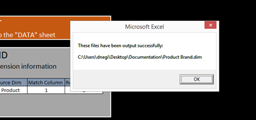

# Configuración de dimensiones derivadas{#derived-dimensions-setup}

Los diferentes tipos de dimensiones derivadas (lado del cliente) y cómo configurarlas en el área de trabajo de datos.

## Tipos de dimensiones derivadas {#section-33e6dcc9ab9745de9b830cecb2427ca3}

**Dimensiones de métricas**

La dimensión de métrica permite agrupar los recuentos de métricas por un nivel específico. También permite agrupar los recuentos de métricas por un nivel específico. Una vez creada una dimensión de métrica, puede segmentar los datos en función del valor de la métrica.

Ejemplo 1: Usted es una empresa de turismo y desea comprender la diferencia de las actividades conductuales en el sitio web entre sus clientes frecuentes y los clientes que han reservado vuelos menos de 5 veces, ¿cómo lo haría?

Todo lo que tiene es contar las reservaciones como métrica, ¿cómo segmentará a los clientes según una métrica -aquí, reservación- para comprender su comportamiento en el sitio web?

Ejemplo 2: Usted es un banco financiero y desea agrupar a sus clientes en función del número de CD en los que han invertido. Desea segmentar a sus clientes en 3 niveles. Nivel 1 - Clientes con más de 10 CDs, Nivel 2 - Clientes con más de 5 y &lt;10 CDs y Nivel 3 - Clientes con más de 0 y menos de 5 CDs

La información que tiene es una métrica que le proporciona recuentos de inversiones en CD: ¿cómo creará segmentos de clientes cansados para su análisis?

*Creación de dimensiones de métricas mediante estación de trabajo*

Marque una de las dimensiones de la métrica OOB como local y cambie el nombre de esa dimensión por un nombre personalizado / Haga una copia local del ejemplo RenameDim.example y cambie el nombre de la dimensión por el nombre correcto con la extensión .dim

Abra la dimensión recién creada en la estación de trabajo para realizar cambios. Cambie los siguientes parámetros de la dimensión de métrica en función de los requisitos: 

Métrica: métrica que se debe agrupar

Nivel: Nivel en el que se agruparán las métricas

Inicio de bloque - Elemento inicial de la dimensión de métrica. Introduzca el mismo valor en desplazamiento.

Tamaño del contenedor: tamaño de agrupación de la métrica. Introduzca el mismo valor en escala

Recuento de bloques: número máximo de elementos que se mostrarán en la dimensión

Guarde la dimensión recién creada en el servidor si desea compartirla con otros usuarios.

**Prefijo de dimensiones**

El objetivo principal de la dimensión Prefijo es agrupar los elementos de la dimensión original y proporcionar nombres prácticos a los elementos agrupados.

Por ejemplo: usted posee un sitio minorista y su sitio tiene varias secciones del sitio como Ropa de mujer, Ropa de hombre, Juguetes y Juegos, Decoración del hogar, etc. y cada una de estas secciones del sitio tiene varias páginas asociadas con él. Desea realizar un análisis de rutas y obtener perspectivas sobre el tráfico que va de una sección del sitio a otra y así sucesivamente. Si utiliza la dimensión URI, se le solicitará que extraiga cada página de cada una de las secciones del sitio en el navegador de rutas o en el mapa del proceso y continúe con el análisis.

El mismo análisis se puede realizar fácilmente si existe una dimensión Prefijo que tenga páginas de una sección del sitio agrupadas como un solo elemento.

Creación de dimensión de prefijo:

Abra un mapa de proceso 2D en el menú Visualización.

Cambie los siguientes parámetros de la dimensión de prefijo según los requisitos.

Dimensión Cambiar mapa: Dimensión que desea utilizar para el mapa de proceso 2D (por ejemplo: Tipología SMS)

Cambiar dimensión de nivel de mapa: nivel de la dimensión mencionada anteriormente

Cambiar dimensión de clip de mapa: el nivel contable en el que desea ver los datos.

Cambiar métrica de mapa: métrica que desea ver.

Una vez definido el mapa de proceso 2D, abra la dimensión que ha mencionado en el parámetro de dimensión de mapa de cambios.

Seleccione los elementos que desee agrupar. Utilice CTRL+ALT y arrastre y suelte los elementos para procesar la asignación.

Haga clic con el botón secundario en el punto que aparece y cambie el nombre del grupo. Si ha seleccionado 3 elementos para agrupar, el nombre predeterminado será 3 Seleccionado.

Haga clic con el botón derecho en el contorno de la visualización y guarde la dimensión en el menú que aparece.

**Cambiar el nombre de las dimensiones**

Cambiar el nombre de las dimensiones se crean a partir de una dimensión preexistente. El objetivo principal de la dimensión de cambio de nombre es proporcionar nombres prácticos a los elementos de la dimensión. La dimensión de cambio de nombre predeterminada es la dimensión Página que se crea a partir de la dimensión URI. La dimensión URI puede resultar confusa para una persona que no conoce nombres técnicos de las páginas y por eso la dimensión Página permite cambiar el nombre de los elementos de la dimensión URI.

CREACIÓN DE DIMENSIONES DE CAMBIO DE NOMBRE PERSONALIZADAS:

Los elementos de la dimensión renombrada contienen una asignación de uno a uno con los elementos de la dimensión base original. Puede verificarlo abriendo el archivo .dim de la dimensión Cambiar nombre en el panel Estación de trabajo/Nota. Observará que cada elemento de la dimensión original tiene un solo valor (Cambiar nombre de cadena) en el archivo.

Si tiene menos elementos para el propósito de cambio de nombre; puede crear un archivo .dim en la estación de trabajo y cambiar el nombre de cada elemento individual según los pasos que se explican a continuación.

Pasos para crear un archivo .dim para una dimensión de cambio de nombre: Uso de la estación de trabajo

Utilice esta opción si los números de elementos que se van a cambiar de nombre son menores.

1. Abra un espacio de trabajo en blanco y abra el Administrador de dimensiones. Haga clic con el botón secundario del mouse (ratón)>Administrador>Perfil>Administrador de perfiles.
1. Expanda la carpeta Dimensiones en la columna Archivo.
1. Expanda la carpeta de página en la columna Archivo y haga clic con el botón derecho en el archivo Page.dim en la columna Segunda a Última (Esta columna generalmente representa el nombre del perfil) y haga clic en la opción &quot;Convertir en local&quot;.
1. Haga clic con el botón derecho en Page.dim en la columna &quot;Usuario&quot; y haga clic en la opción Copiar y Pegue el archivo .dim copiado en la carpeta deseada en el directorio Dimensiones.
1. Haga clic en Aceptar en el mensaje de error.
1. Ahora, observará que hay dos archivos Page.dim en la carpeta Dimensiones. Uno es el archivo original en el directorio Dimensiones\Página y el segundo es el que se copia pegado en el paso 4.
1. Haga clic con el botón derecho en el archivo Page.dim que se ha pegado recientemente en la columna Usuario y haga clic en el cuadro de entrada azul/gris que indica Page.dim. El cuadro de entrada se volverá verde con el cursor parpadeando, indicando que se puede modificar. Escriba el nombre de la dimensión Cambiar nombre que desee crear.
1. Observará que el archivo Page.dim de la columna Archivo se cambió al nuevo nombre de archivo que dio en el paso 7. Haga clic con el botón derecho en el archivo new.dim de la columna Usuario (última columna) y seleccione Abrir>En estación de trabajo.
1. Una vez abierto el archivo .dim en la estación de trabajo; haga clic en el signo más (+) junto a la entidad y expórtelo. Observe el valor presente en el campo &quot;Principal&quot;, refleja la dimensión &quot;URI&quot;. Muestra &quot;wdata/model/dim/URI&quot; Haga clic en el cuadro de entrada azul/gris para cambiar el URI al nombre de la dimensión cuyos elementos desee cambiar.
1. Asegúrese de que la dimensión a la que desea cambiar el nombre no existe en el conjunto de datos. Los nombres de dimensión distinguen entre mayúsculas y minúsculas, por lo que se conservan las mayúsculas y minúsculas de la dimensión original.
1. Observe que aparece &quot;modificado&quot; junto al nombre de la dimensión. Esto indica que se ha modificado la dimensión original. Mantener los cambios introducidos en la etapa 9; Haga clic con el botón derecho en new.dim (modificado) y haga clic en la opción &quot;Guardar como&quot;.
1. Una vez guardada la dimensión por cada paso 10, la nueva dimensión de cambio de nombre creada para las campañas estará ahora disponible para usted con el fin de cambiar el nombre. Solo está disponible localmente.
1. Para que otros puedan ver la dimensión creada por usted, debe guardarse en el perfil. Haga clic con el botón derecho en el archivo .dim de la nueva dimensión en la columna &quot;Usuario&quot; (última columna) y haga clic en &quot;Guardar en>Nombre de perfil&quot; en la que desea guardar la dimensión.
1. Después de guardar el archivo en el perfil, todos los usuarios de Workstation que tengan acceso a este perfil podrán ver la dimensión de cambio de nombre para las Campañas.

Herramienta de creación de dim. de prefijo y cambio de nombre

Adobe dispone de una herramienta de Excel para generar Prefijos y Cambiar el nombre de las dimensiones.

A continuación se indican los pasos para generar las dimensiones Prefijo/Cambiar nombre con la herramienta:

1. Guarde la herramienta de Excel *Adobe_DWB_Dimension_Generator.xlsm* en una carpeta. Póngase en contacto con el Servicio de atención al cliente de Adobe para descargar la herramienta.
1. Abra la herramienta y active macros: 

1. Rellene la hoja de datos con los valores que se utilizarán.

   Por ejemplo, estamos creando una dimensión Prefijo de marca de producto basada en la dimensión de producto. En la hoja de datos, se captura la siguiente información: 

   Cada producto se asigna a una marca en la hoja de datos.

1. En la ficha Configuración, rellene la información relacionada con la dimensión que se va a crear. Para los datos de muestra anteriores, se introduce la siguiente información: 

   Nombre: Nombre de la dimensión Prefijo/Cambiar nombre

   Tipo: Prefijo/Cambiar nombre

   Dimensión de origen: Dimensión original

   Coincidir columna: Columna que se debe comparar

   Columna Resultado: Valor que se utilizará para la nueva dimensión.

1. Haga clic en el botón titulado *Haga clic aquí*. 

1. El archivo dim se generará en la misma carpeta en la que se guardó la herramienta. 

   Con el Administrador de perfiles, guarde el archivo dim en la carpeta Dimension.

**Cambiar dimensiones**

Las dimensiones de desplazamiento le permiten ver el elemento Nth de cualquier dimensión en cualquier dimensión contable en particular.

También le permiten mirar hacia atrás el elemento -Nth de cualquier dimensión dentro de cualquier dimensión contable en particular

Ejemplo 1:

* La novena página de una sesión: dimensión de página siguiente
* La novena página para un visitante -Página siguiente para el visitante- en todas las sesiones
* La novena llamada para un usuario

¿Por qué es importante conocer el elemento Nth de la dimensión contable?

* Desea conocer la quinta página vista en una sesión.
* ¿Desea realizar rutas en Campañas para comprender cuál fue la segunda campaña vista después de ver la campaña &quot;Cuenta de verificación gratuita&quot;?
* ¿Desea saber en qué vínculo hizo clic el visitante antes de hacer clic en el vínculo &quot;Chat con un agente&quot;? 

El URI siguiente es una de las dimensiones de desplazamiento OOB que se puede utilizar como plantilla. El ejemplo anterior le proporciona el segundo elemento (desplazamiento = 1) de la campaña (Dim = campaña) en el evento de participación (clip = evento de participación)

Aquí el desplazamiento 1 significa mirar hacia la derecha en el evento

Otras dimensiones de desplazamiento OOB

*Página siguiente:*

Página siguiente vista en una sesión después de seleccionar Página en la dimensión de página

El desplazamiento aquí es 1, el nivel es la vista de página, la atenuación es la página y el clip es la sesión

*Página anterior:*

Página anterior vista en una sesión antes de seleccionar Página en la dimensión de página

El desplazamiento aquí es -1, el nivel es la vista de página, la atenuación es la página y el clip es la sesión

¿Cuál será la campaña anterior vista por un visitante antes de la campaña seleccionada actualmente?

El desplazamiento aquí es -1, el nivel es respuesta a la campaña, el dim es el valor del atributo de respuesta a la campaña y el clip es visitante

*Creación de una dimensión de cambio - Mediante estación de trabajo*

* Marcar una dimensión de desplazamiento OOB como local
* Cambiar el nombre de esa dimensión con un nombre personalizado
* Abra la dimensión recién creada en la estación de trabajo para realizar cambios
* Cambie los siguientes parámetros de la dimensión de métrica en función de los requisitos.

   * Dimensión de nivel contable
   * Desplazamiento: desea mirar hacia delante hacia atrás
   * Dimensión atenuada cuyos elementos desea analizar
   * Recuento de clips en el que desea ver.

* Guarde la dimensión recién creada en el servidor si desea compartirla con otros usuarios.

**Última dimensión N**

Las últimas N dimensiones solo funcionan en la dimensión de tiempo y en el tiempo de funcionamiento del sistema. Las dimensiones de tiempo OOB son Día, Semana, Hora y Mes. Puede crear la dimensión Última N para cada una de estas dimensiones de tiempo base, como Últimos 10 días, Últimas 72 horas, Últimas 8 semanas, Últimos 6 meses, etc. La última dimensión N calcula la última N en función de la &quot;Métrica de tiempo del informe&quot; o del Tiempo del sistema actual. 

Recuento: número total de elementos que se mostrarán en la dimensión

Desplazamiento de rango: valor de desplazamiento para indicar el punto de inicio (día/semana) para calcular el último N día/semana.

**None.dim**

None.dim es una dimensión Alias. Se utiliza para crear alias a partir de dimensiones extendidas.

Ejemplo:

En None.dim, la entidad se define como &quot;wdata/model/dim/Parent/+name&quot; (se puede cambiar), lo que significa que se debe crear la dimensión según el nombre del archivo de dimensión. Por lo tanto, si creamos una copia del archivo None.dim en la carpeta Dimension (por ejemplo, copiando y cambiando el nombre del archivo None.dim en la carpeta Visitor Profile) y lo cambiamos a &quot;Log Source ID.dim&quot;, aparecerá una nueva dimensión derivada con el ID de origen de registro en el menú en Perfil del visitante, como se muestra a continuación:

Antes de los cambios: 

Después de los cambios de None.dim: 

La entidad puede cambiarse por el nombre de la dimensión extendida, en este caso otra dimensión con otro nombre que apunte a la misma dimensión como se muestra a continuación:

En este ejemplo, &quot;Source Name.dim&quot; tiene el siguiente contenido: 

De modo que aparecerá otro nombre de origen de dimensión que señale a la ID de origen de registro. 

**Ocultar dimensiones derivadas**

Para ocultar la dimensión derivada, establezca la propiedad *Mostrar* en &quot;false&quot;. 

