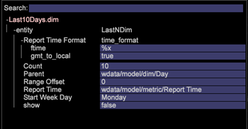

# Configuración de dimensiones derivadas{#derived-dimensions-setup}

{{eol}}

Los diferentes tipos de Dimension derivados (lado del cliente) y cómo configurarlos en la Data Workbench.

## Tipos de Dimension derivados {#section-33e6dcc9ab9745de9b830cecb2427ca3}

**Dimension de métricas**

El Dimension de métricas le permite agrupar recuentos de métricas por un nivel específico. También le permite agrupar recuentos de métricas por un nivel específico. Una vez creado el Dimension de métricas, puede segmentar los datos en función del valor de la métrica.

Ejemplo 1: Usted es una empresa de viajes y desea comprender la diferencia de las actividades de comportamiento en el sitio web entre sus clientes frecuentes y los clientes que han reservado vuelos menos de 5 veces, ¿cómo lo haría?

Todo lo que tiene es contar los registros como métrica, ¿cómo segmentará a los clientes según una métrica -aquí, reservando- para comprender su comportamiento en el sitio web?

Ejemplo 2: Usted es un banco financiero y desea agrupar a sus clientes en función de la cantidad de CD en los que hayan invertido. Desea segmentar a sus clientes en 3 niveles. Nivel 1: Clientes con más de 10 CDs, Nivel 2: Clientes con >5 y &lt;10 CDs y Nivel 3: Clientes con >0 y &lt;5 CDs

La información que tiene es una métrica que le proporciona recuentos de inversiones en CD, ¿cómo creará Segmentos de Cliente Cansados para su análisis?

*Creación del Dimension de métricas: mediante Workstation*

Marque una de las dimensiones de métricas de OOB como local y cambie el nombre de esa dimensión con un nombre personalizado / Haga una copia local del ejemplo Cambiar nombre de dimensión y cambie el nombre a el nombre de dimensión adecuado con la extensión .dim

Abra la dimensión recién creada en la estación de trabajo para realizar cambios. Cambie los siguientes parámetros de la dimensión de métrica en función de los requisitos: 

Métrica - Métrica que se va a agrupar

Nivel: nivel en el que se agrupan las métricas

Inicio de bloque : elemento inicial del Dimension de métricas. Introduzca el mismo valor en offset.

Tamaño de contenedor : tamaño de agrupación de la métrica. Introduzca el mismo valor en escala

Recuento de bloques : número máximo de elementos que se mostrarán en la dimensión

Guarde la dimensión recién creada en el servidor si desea compartirla con otras personas.

**Dimension de prefijo**

El objetivo principal de la dimensión Prefijo es agrupar los elementos de la dimensión original y proporcionar nombres descriptivos a los elementos agrupados.

Por ejemplo: es propietario de un sitio de venta minorista y el sitio tiene varias secciones del sitio, como Ropa de mujer, Ropa de hombre, Juguetes y juegos, Decoración del hogar, etc., y cada una de estas secciones del sitio tiene varias páginas asociadas a él. Desea realizar un análisis de rutas y obtener perspectivas sobre el tráfico que va de una sección del sitio a otra, etc. Si utiliza la dimensión URI, se le pedirá que extraiga cada página de cada sección del sitio en el explorador de rutas o en el mapa de procesos y continúe con el análisis.

El mismo análisis se puede realizar fácilmente si hay una dimensión Prefijo que tenga páginas de una sección del sitio agrupadas como un solo elemento.

Creación del Dimension de prefijo:

Abra un mapa de proceso 2D en el menú Visualización .

Cambie los siguientes parámetros de la dimensión de prefijo según los requisitos.

Dimension de cambio de mapa : el Dimension que desea usar para el mapa de proceso 2D (por ejemplo: Tipología de SMS)

Dimension Cambiar nivel de mapa : nivel de la dimensión mencionada anteriormente

Cambiar Dimension de clip de mapa : nivel contable en el que desea ver los datos.

Cambiar métrica de mapa : la métrica que desea ver.

Una vez configurado el mapa de proceso 2D, abra la dimensión que ha mencionado en el parámetro del Dimension de mapa de cambios .

Seleccione los elementos que desee agrupar. Utilice CTRL+ALT y arrastre y suelte los elementos en para procesar el mapa.

Haga clic con el botón derecho en el punto que aparece y cambie el nombre del grupo. Si ha seleccionado 3 elementos para agrupar, el nombre predeterminado será 3 Seleccionado.

Haga clic con el botón derecho en el contorno de la visualización y guarde la dimensión desde el menú que aparece.

**Cambiar el nombre de los Dimension**

Los Dimension de cambio de nombre se crean a partir de una dimensión preexistente. El objetivo principal de la dimensión de cambio de nombre es proporcionar nombres descriptivos a los elementos de la dimensión. La dimensión Cambiar nombre fuera de la caja es la dimensión Página que se crea a partir de la dimensión URI. La dimensión URI puede resultar confusa para una persona que no conoce nombres técnicos de las páginas y por eso la dimensión Página permite cambiar el nombre de los elementos de la dimensión URI.

CREACIÓN DE DIMENSION DE CAMBIO DE NOMBRE PERSONALIZADOS:

Los elementos de la dimensión Nuevo nombre contienen una asignación de uno a uno con los elementos de la dimensión base original. Para verificarlo, abra el archivo .dim del Dimension Cambiar nombre en el panel Estación de trabajo/Nota. Observará que cada elemento de la dimensión original tiene un solo valor (Cambiar nombre de cadena) en el archivo.

Si tiene menos elementos para el propósito de cambio de nombre; puede crear un archivo .dim en la estación de trabajo y cambiar el nombre de cada uno de los elementos por los pasos que se explican a continuación.

Pasos para crear un archivo .dim para un Dimension de cambio de nombre: uso de la estación de trabajo

Utilice esta opción si los números de elementos que desea cambiar de nombre son menores.

1. Abra un espacio de trabajo en blanco y abra el Administrador de Dimension. Haga clic con el botón derecho del ratón > Administración > Perfil > Administrador de perfiles.
1. Expanda la carpeta Dimension en la columna Archivo .
1. Expanda la carpeta de la página en la columna Archivo y haga clic con el botón derecho en el archivo Page.dim en la columna Segundo a Último (esta columna suele representar el nombre del perfil) y haga clic en la opción &quot;Convertir en local&quot;.
1. Haga clic con el botón derecho en Page.dim en la columna &quot;Usuario&quot;, haga clic en la opción Copiar y pegue el archivo .dim copiado en la carpeta deseada en el directorio Dimension.
1. Haga clic en Aceptar en el mensaje de error.
1. Ahora, verá que hay dos archivos Page.dim en la carpeta Dimension. Uno es el archivo original en el directorio Dimension\Página y el segundo es el que acaba de copiar pegado en el paso 4.
1. Haga clic con el botón derecho en el archivo Page.dim pegado recientemente en la columna Usuario y haga clic en el cuadro de entrada azul/gris que dice Página.dim. La casilla de entrada cambiará a verde con el cursor parpadeando, indicando que se puede modificar. Escriba el nombre de la dimensión Cambiar nombre que desea crear.
1. Verá que el archivo Page.dim de la columna Archivo se cambió por el nuevo nombre de archivo que dio en el paso 7. Haga clic con el botón derecho en el nuevo archivo.dim de la columna Usuario (última columna) y seleccione Abrir > En estación de trabajo.
1. Una vez abierto el archivo .dim en la estación de trabajo; haga clic en el signo más (+) situado junto a la entidad y expanda. Observe el valor presente en el campo &quot;Principal&quot;, refleja la dimensión &quot;URI&quot;. Muestra &quot;wdata/model/dim/URI&quot;. Haga clic en el cuadro de entrada azul/gris para cambiar el URI al nombre de la dimensión cuyos elementos desea cambiar de nombre.
1. Asegúrese de que la dimensión a la que desea cambiar el nombre no exista en el conjunto de datos. Los nombres de los Dimension distinguen entre mayúsculas y minúsculas, por lo que deben conservarse las mayúsculas y minúsculas de la dimensión original.
1. Observe que aparece &quot;modificado&quot; junto al nombre de la dimensión. Esto indica que se ha modificado la dimensión original. Mantener los cambios realizados en la etapa 9; Haga clic con el botón derecho en new.dim (modificado) y haga clic en la opción &quot;Guardar como&quot;.
1. Una vez guardada la dimensión por el paso 10, la dimensión de cambio de nombre recién creada para las campañas ya está disponible para el propósito de cambiar el nombre. Esto solo está disponible localmente.
1. Para que otros puedan ver la dimensión creada por usted, debe guardarse en el perfil. Haga clic con el botón derecho en el archivo .dim de la nueva dimensión en la columna &quot;Usuario&quot; (última columna) y haga clic en &quot;Guardar en>Nombre de perfil&quot; en la que desea guardar la dimensión.
1. Después de guardar el archivo en el perfil, todos los usuarios de Workstation que tengan acceso a este perfil podrán ver la dimensión de cambio de nombre para las Campañas.

Herramienta de creación de prefijo y cambio de nombre de atenuación

Adobe tiene una herramienta de Excel para generar Dimension de prefijo y cambio de nombre.

A continuación se muestran los pasos para generar las dimensiones Prefijo/Cambiar nombre mediante la herramienta:

1. Guardar la herramienta Excel *Adobe_DWB_Dimension_Generator.xlsm* en una carpeta. Póngase en contacto con el Servicio de atención al cliente de Adobe para descargar la herramienta.
1. Abra la herramienta y habilite macros: 

1. Rellene la hoja de datos con los valores que desee utilizar.

   Por ejemplo, estamos creando la dimensión Prefijo de marca de producto basada en el Dimension de producto. En la hoja de datos, se captura la siguiente información: 

   Cada producto se asigna a una marca de la hoja de datos.

1. En la pestaña Configuration , rellene la información relacionada con la dimensión que se va a crear. Para obtener los datos de ejemplo anteriores, se introduce la siguiente información: 

   Nombre: Nombre de la dimensión Prefijo/Cambiar nombre

   Tipo: Prefijo/Cambiar nombre

   Dim de origen: Dimension original

   Coincidir columna: Columna a comparar

   Columna de resultado: Valor que se utilizará para la nueva dimensión.

1. Haga clic en el botón denominado *Haga clic aquí*. 

1. El archivo dim se generará en la misma carpeta donde se guardó la herramienta. 

   Con el Administrador de perfiles, guarde el archivo dim en la carpeta del Dimension.

**Dimension de Mayús**

Las dimensiones de desplazamiento le permiten ver el elemento Nth de cualquier dimensión en cualquier Dimension contable en particular.

También le permiten mirar hacia atrás el elemento -Nth de cualquier dimensión dentro de cualquier Dimension contable en particular

Ejemplo 1:

* La novena página de una sesión: Dimension de página siguiente
* La novena página para un visitante: página siguiente para el visitante en todas las sesiones
* La Nth call para un usuario

¿Por qué es importante conocer el elemento Nth de la dimensión contable?

* Desea conocer la quinta página vista en una sesión.
* ¿Desea realizar rutas en Campañas para comprender cuál fue la segunda campaña vista después de ver la campaña &quot;Cuenta de Comprobación Libre&quot;?
* ¿Desea comprender en qué vínculo hizo clic el visitante antes de hacer clic en el vínculo &quot;Chatear con un agente&quot;? 

El URI siguiente es una de las dimensiones de desplazamiento OOB que se puede utilizar como plantilla. El ejemplo anterior le da el segundo elemento (Desplazamiento = 1) de la campaña (Dim = Campaña) en el Evento de participación (Clip = Evento de participación)

El desplazamiento 1 significa que se ve hacia la derecha en el evento

Otros Dimension de desplazamiento OOB

*Página siguiente:*

La página siguiente que se ve en una sesión después de seleccionar Página en el Dimension de página

El desplazamiento es 1, el nivel es la vista de página, la atenuación es la página y el clip es la sesión

*Página anterior:*

La página anterior vista en una sesión antes de seleccionar Página en el Dimension de página

El desplazamiento es -1, el nivel es la vista de página, la atenuación es la página y el clip es la sesión

¿Cuál será la Campaña anterior vista antes de la Campaña seleccionada actualmente por un visitante?

El desplazamiento aquí es -1, el nivel es la respuesta de la campaña, la atenuación es el valor del atributo de respuesta de la campaña y el clip es el visitante

*Creación del Dimension de cambio - Mediante Workstation*

* Marque una de las dimensiones de desplazamiento OOB como local
* Cambiar el nombre de esa dimensión con un nombre personalizado
* Abra la dimensión recién creada en la estación de trabajo para realizar cambios
* Cambie los siguientes parámetros de la dimensión de métrica en función de los requisitos.

   * Dimensión contable de nivel
   * Desplazamiento: desea mirar hacia delante hacia atrás.
   * Dim: Dimension cuyos elementos desea analizar
   * Recuento de clips en el que desea ver.

* Guarde la dimensión recién creada en el servidor si desea compartirla con otras personas.

**Último N Dimension**

Los últimos N Dimension solo funcionan en el Dimension de tiempo y en el valor Con fecha del sistema. Las dimensiones de tiempo OOB son Día, Semana, Hora y Mes. Puede crear la dimensión Última N para cada una de estas dimensiones de tiempo base, como Últimos 10 días, Últimas 72 horas, Últimas 8 semanas, Últimos 6 meses, etc. El Dimension Última N calcula la Última N en función de la &quot;Métrica de tiempo del informe&quot; o la métrica A partir del tiempo del sistema actual. 

Recuento : Número total de elementos que se mostrarán en la dimensión

Desplazamiento de rango : valor de desplazamiento para indicar el punto de inicio (Día/Semana) para calcular el último N día/semana.

**None.dim**

None.dim es una dimensión Alias . Se utiliza para crear alias a partir de dimensiones extendidas.

Ejemplo:

En None.dim, la entidad se define como &quot;wdata/model/dim/Parent/+name&quot; (se puede cambiar), lo que significa que se crea la dimensión según el nombre del archivo de dimensión. Por lo tanto, si creamos una copia del archivo None.dim en la carpeta Dimension (por ejemplo, copiando y cambiando el nombre del archivo None.dim en la carpeta Perfil del visitante) y lo cambiamos por el nombre &quot;ID.dim de origen de registro&quot;, aparecerá una nueva dimensión derivada con ID de origen de registro en el menú en Perfil del visitante, como se muestra a continuación:

Antes de los cambios: 

Después de los cambios de None.dim: 

La entidad se puede cambiar por el nombre de la dimensión extendida, en este caso otra dimensión con otro nombre que señale a la misma dimensión como se muestra a continuación:

En este ejemplo, el &quot;Source Name.dim&quot; tiene el siguiente contenido: 

Por lo tanto, aparecerá otro nombre de origen de Dimension que señale al ID de origen de registro. 

**Ocultar Dimension derivados**

Para ocultar el Dimension Derivado, establezca la variable *Show* en &quot;false&quot;. 
