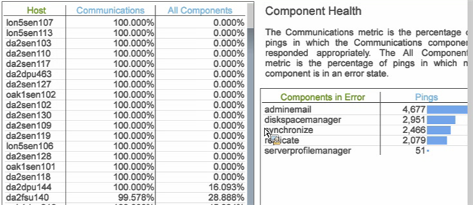

# Área de trabajo de datos Espacio de trabajo histórico{#data-workbench-historic-workspace}

Utilice el perfil histórico del área de trabajo de datos para ver cómo la configuración, el hardware y otros cambios afectan el rendimiento, la estabilidad y la capacidad del servidor con el paso del tiempo.

El perfil Histórico incluye un conjunto de datos de rendimiento [de](../../../home/monitoring-installation/monitoring-profiles/monitoring-historical-using.md#section-184a86f9de054970bf68515bb9dea85d) perfil basado en perfiles y el conjunto de datos de rendimiento [de](../../../home/monitoring-installation/monitoring-profiles/monitoring-historical-using.md#section-5dad5870384b40e094d50173fcd90a09) servidor basado en servidor en la ficha **[!UICONTROL Performance]** . Estos son los conjuntos de datos más utilizados y vistos desde una perspectiva anterior del rendimiento del servidor del área de trabajo de datos. Además, puede ver los [componentes](../../../home/monitoring-installation/monitoring-profiles/monitoring-historical-using.md#section-5be7223abb384784bafe7b37c764ea66) y el modo  de procesamiento seleccionando la **[!UICONTROL Up Time]** ficha.

Además, puede ver los [componentes](../../../home/monitoring-installation/monitoring-profiles/monitoring-historical-using.md#section-5be7223abb384784bafe7b37c764ea66) y el modo  de procesamiento seleccionando la **[!UICONTROL Up Time]** ficha.

Para obtener información de referencia adicional sobre las dimensiones utilizadas en el perfil histórico del área de trabajo de datos, consulte [Dimensiones en el perfil histórico de Insight.](../../../home/monitoring-installation/monitoring-appendix/monitoring-historical.md#concept-a42837c9c9274f83ad5bc5a6720f02b0)

## Espacio de trabajo Rendimiento del perfil {#section-184a86f9de054970bf68515bb9dea85d}

Este conjunto de datos incluye las siguientes métricas relevantes para la supervisión del área de trabajo de datos.

* MegaBytes por minuto de entrada rápida: métricas que muestran una gran cantidad de datos introducidos durante el procesamiento inicial del registro.
* Fusión rápida de megaBytes por minuto: métricas que muestran la transformación.

>[!NOTE]
>
>Para realizar una evaluación del rendimiento real de su perfil, observe la velocidad en lugar del tiempo de calendario transcurrido. La tasa se mide como los valores modificados entre las encuestas cada diez minutos.

## Espacio de trabajo Rendimiento del servidor {#section-5dad5870384b40e094d50173fcd90a09}

Este conjunto de datos supervisa las métricas del servidor más allá del ámbito de los perfiles incluidos e incluye las siguientes métricas relevantes del servidor para la supervisión del área de trabajo de datos.

* Minutos estimados de barrido — Tiempo de resolución de consulta estimado.
* Milisegundos de latencia de la encuesta — Indicador de cuán ocupado está el software al medir cuánto tiempo se tarda en pasar por un ciclo completo de mantenimiento de cada componente.

## Espacio de trabajo Componentes {#section-5be7223abb384784bafe7b37c764ea66}

Este conjunto de datos se encuentra en la ficha Tiempo de actividad.

El conjunto de datos Componentes incluye dos aspectos para el estado de los componentes:

* Métrica de comunicaciones — ¿Respondió el proceso del servidor del área de trabajo de datos?
* Métrica Todos los componentes — En la parte superior de la página Estado detallado hay una lista de los componentes que el host está administrando dentro de los procesos del servidor del área de trabajo de datos. Si algún componente está en estado de error, se muestra en la tabla Componentes en error.

## Espacio de trabajo de modo de procesamiento {#section-3e1dedb9474e4b4ba513240943e76817}

Este espacio de trabajo se encuentra en la ficha Tiempo de actividad. Este espacio de trabajo permite observar cuánto tiempo se tarda en introducir datos rápidamente, combinar rápidamente y en tiempo real.

Este conjunto de datos proporciona características importantes de carga del servidor, como identificar la carga de datos para

* Día de la semana (por ejemplo, una Tasa de entrada rápida el martes y el miércoles),
* Hora del día (¿qué porcentaje del día se encuentra en el modo de entrada rápida?)

